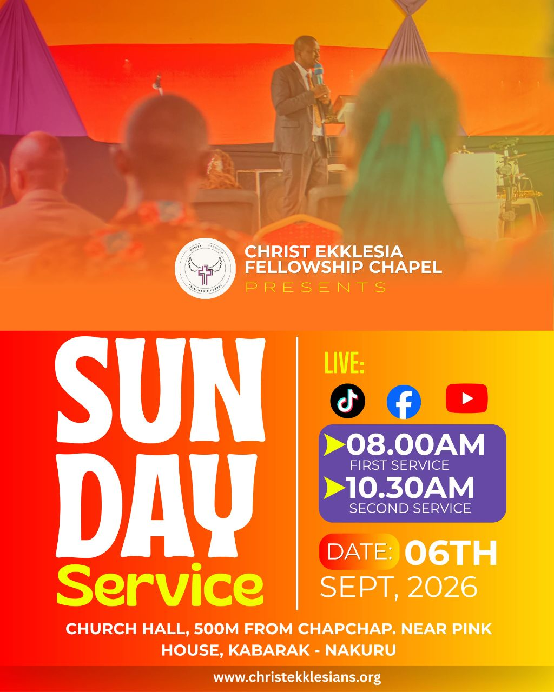

# Warm gradient Sunday service — photograph with split information layout

- **ID:** church-service-001
- **Category:** Church and Worship
- **Subcategory:** Church Service
- **Tags:** Sunday service; congregation photograph; two services; livestream platforms; specific date; warm gradient; oversized typography; two-column details; no theme.
- **Source:** user-supplied `photo_2026-09-06_10-25-24.jpg`.
- **Editable source:** unavailable; flattened image only.
- **Status:** user-selected positive example; annotated from the image and the user's explanation.
- **Asset reuse:** reference only; ownership and reuse permissions have not been recorded. Do not automatically reuse its photograph, logo, or church identity in new designs.

## Suitable brief and design character

A church-service announcement with an atmospheric congregation photograph, two service times, livestream availability, a specific date, venue, and website. The user values its elegant organisation, bold headline, coordinated colours, and grouped details. The visible character is warm, energetic, welcoming, and bold.

## Composition

The upper portion contains a full-width church-service photograph. A warm treatment and a fade toward orange near the lower edge soften the photograph and provide a readable church-identity region. The photograph occupies roughly the upper half; this is a reference proportion, not a fixed requirement.

A circular logo sits beside the two-line church name. Together they form one identity group near the bottom of the photograph. Widely spaced “Presents” sits below the name.

The lower portion uses a horizontal red–orange–yellow gradient and two columns separated by a thin light vertical rule. The left column contains “SUN”, “DAY”, and “Service”. The right column contains livestream platforms, a schedule card, and a date group. A centred location spans the width below the columns; the website sits in a darker bottom strip.

## Hierarchy and typography

“SUNDAY” is the dominant message. Its deliberate “SUN” / “DAY” line break produces a tall, compact headline in the left column. This is a word-specific treatment, not a rule to split arbitrary event titles.

“Service” is smaller, yellow, and approximately matches the headline width. Match the group through suitable font choice, size, and spacing rather than excessive horizontal stretching. Exact font families have not been identified.

Both service times are bold and large. Their supporting labels are smaller and sit beneath the corresponding time. Keep the entries aligned within one card.

The day and ordinal (“06TH”) are prominent beside a “DATE” badge; “SEPT, 2026” occupies the next line. Preserve a compact date group rather than forcing all components into a single line.

The location is smaller, bold, centred, and wrapped over two lines. The website is the final, quieter contact point.

## Colour and imagery

Red, orange, and yellow establish the warm palette. White carries most factual information. Yellow highlights “Service”, “Live”, and the schedule markers.

The purple schedule card contrasts with the warm background. Purple is also visible in the photograph and logo; the user explains this as the reason for choosing the accent. Retain this principle of selecting an accent related to the imagery or identity when adapting the design, rather than requiring purple universally.

The photograph conveys the church environment rather than introducing a separately labelled speaker. Preserve enough detail to communicate the setting, while keeping overlaid identity text readable.

## Functional decoration

- The vertical rule separates the title and logistics columns.
- The rounded purple card groups both service entries.
- Yellow directional markers emphasise each service time.
- The rounded gradient “DATE” badge repeats the main palette and labels the date.
- The darker footer strip separates the website from the location.

Each element supports grouping, emphasis, or separation. Do not add unrelated ornaments simply to fill space. If the original marker is unavailable, use a consistently aligned chevron such as `›` or `>`; the user explicitly accepts this substitution.

## Content meaning

TikTok, Facebook, and YouTube icons indicate livestream availability. No social handles are supplied; do not invent them. There is no separate theme line or speaker-name block.

The reference contains a specific September 2026 date, two service times, a church name, a venue, and a website. These are example facts only. Use the new brief's exact facts when generating another poster; never carry over the reference wording automatically.

## Adaptation rules

- **One service:** remove the unused entry, resize the schedule card, and rebalance the right column.
- **More services:** expand the schedule region only while readability remains strong; choose another composition if it becomes crowded.
- **Recurring service:** replace the dated group with “Every Sunday” and rebalance spacing.
- **Long church name:** wrap within the identity region, preserving logo/name alignment and readable size.
- **Theme added:** allocate a deliberate subheading region and rebalance the composition; do not insert it into an accidental gap.
- **Long venue:** reserve more height and wrap before further reducing text size. Inspect readability at the intended display size.
- **Different photograph:** choose a crop with room for the church identity, keep important subjects clear, and adjust the overlay to the new image.
- **Different palette:** preserve contrast and a distinct schedule accent. Exact reference colours are optional.
- **No photograph:** choose a related typography-led recipe instead of leaving the upper half empty.
- **No livestream:** remove that group and redistribute the space above the schedule.
- **Different title:** choose appropriate line breaks; do not force the “SUN” / “DAY” construction onto unrelated wording.

## Preserve and vary

Preserve dominant title hierarchy, a coherent identity group, aligned schedule entries, clear information separation, and a readable footer. Vary imagery, palette, font pairing, proportions, and compatible decorative treatments to suit the brief. This example teaches relationships; it does not require every church-service poster to use this composition.

## Quality checks

Verify all supplied wording, times, dates, venue, and contact information. Check text contrast over both the photograph and the bright end of the gradient. Inspect small-size readability, column padding, schedule alignment, title grouping, and location wrapping. Ensure the vertical rule and markers do not crowd text. Compare the final render, not only its numeric layout properties.

## Evidence and uncertainty

The user describes reduced photo opacity. The visible result is softened and warmly tinted with a fade toward orange; the flattened image cannot establish whether opacity, an overlay, masking, or a combination produced it. Implement the visible effect without claiming the original method is known.

Gradient direction, grouping, line breaks, and displayed elements are visible observations. Exact colour values, fonts, layer geometry, and original effect settings are unverified. The user's positive assessment is a preference signal, not proof that every detail will work at every output size.
