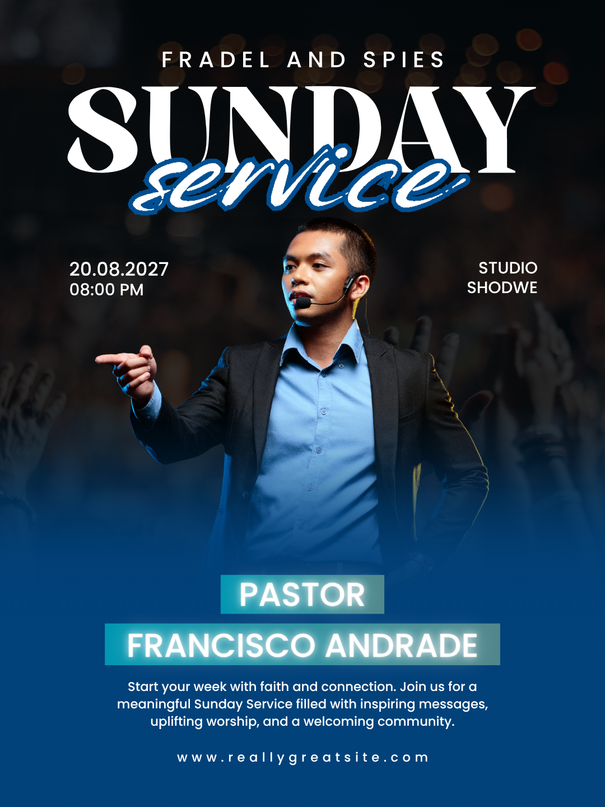

# Blue Sunday service — central pastor with serif and script headline

- **ID:** church-service-002
- **Category:** Church and Worship
- **Subcategory:** Church Service
- **Tags:** Sunday service; single pastor; central cutout portrait; worship background; bottom fade; blue palette; serif/script pairing; outlined script; glowing nameplates; single service; specific date; short venue; no logo in reference.
- **Source:** user-supplied `Blue Black and White Modern Sunday Service Instagram Post.png`.
- **Editable source:** unavailable; flattened image only.
- **Status:** user-selected positive example; annotated from the image and the user's explanation. Suggested adaptations are distinguished from visible features below.
- **Asset reuse:** reference only; ownership and reuse permissions have not been recorded. Do not automatically reuse the depicted person or identity in new designs.

## Suitable brief and design character

A service announcement featuring one pastor or speaker, one main date and start time, a short venue, supporting information, and a website. The design is dramatic and speaker-led, with a dark photographic upper area, a saturated blue lower area, and high-contrast white typography. A formal serif headline and expressive script subtitle provide variety without adding unrelated decoration.

## Composition and hierarchy

The top identity line is centred, uppercase, and widely letter-spaced. The supplied image reads “FRADEL AND SPIES”; treat this as example identity text, not a verified church name. No logo appears in the reference.

Large white “SUNDAY” spans most of the width below the identity. White brush-script “service” overlaps its lower edge with a strong blue outline. Together they form a single headline group, using contrasting type styles rather than matching fonts.

A cutout speaker occupies the centre beneath the headline. Keep the face clear of the headline and supporting text. The left logistics block contains the date above the start time; the right contains a short, two-line venue. Both side blocks begin at approximately the same height and occupy negative space around the portrait.

The portrait's lower body blends into the blue lower region. Centred role and name labels follow, each on its own rectangular cyan/blue-toned backing. Supporting copy sits below the name, followed by a centred website near the bottom. Maintain a reading path from identity and event title to speaker and logistics, then supporting details and contact.

## Typography, colour, and imagery

Use a high-contrast display serif for “SUNDAY” and a bold brush-script style for “service”. Exact fonts are unverified; select supported fonts by their visual characteristics. The script has a white face and blue outline. Adjust outline thickness to separate overlapping letters while preserving counters and legibility; do not treat it as dimensional extrusion.

The rest of the information uses relatively simple white sans-serif text. The speaker's name is prominent, with the role on a separate smaller-width label above it. Supporting text is smaller and centred, with restrained line length. The website in the reference has wide tracking, but actual URLs must retain their exact characters; use character-spacing styling rather than inserting spaces into the stored URL.

The background contains dark, soft-focus lights and worship-like raised-hand silhouettes. It blends toward blue at the bottom. The speaker remains sharper and more prominent than the background, with clothing colours that relate to the blue palette.

The role and name show a soft light glow against rectangular blue/cyan-toned backings. Keep the glow subordinate to the letterforms so it does not wash out the text.

## Functional decoration and suggested construction

- **Background fade:** the user proposes a blue base behind a worship photograph, with a bottom-edge fade revealing that base. This is a suitable reconstruction recipe, not a confirmed original layer stack.
- **Portrait fade:** fade the lower torso into the same blue field, while preserving the face, upper body, and meaningful gesture. Avoid a visible rectangular crop edge.
- **Outlined script:** use editable white script text with a blue stroke; tune stroke thickness on the final render.
- **Nameplate glow:** the user's proposed method is a white text shadow with horizontal and vertical offsets set to zero, then increased blur. Tune blur and opacity to the font size and output scale. Keep the blue-toned backing as a separate shape; text glow and backing are distinct components.
- **Website icon adaptation:** no website icon is visible in this reference. The user requests an optional transparent web/globe icon before the URL, tinted fully white to match the text. Centre the combined icon-and-text group, align their visual centres, and leave a deliberate gap.

The user reports that edge fade, outline, shadow, and icon tint controls exist in the editor. This annotation records intended use; runtime support and exact property mappings have not been verified here.

## Content meaning

The side time is one service's start time, not a two-service schedule. The speaker's role and name are separate fields; use the supplied role (Pastor, Reverend, Bishop, or another title) without inferring it from appearance.

The source has descriptive invitation copy beneath the speaker. For new designs, this region may instead contain supplied additional service details or relevant information not shown above. Do not invent schedules, claims, or contact details to fill space.

All source wording, the displayed date, time, venue, speaker name, and example website are reference data only. For a Sunday announcement, check that any supplied calendar date agrees with the weekday. If they conflict, flag the conflict rather than silently changing either value or copying this example's date.

## User-preferred adaptations

**Logo:** the user prefers an optional logo centred above the church name. A right-side placement is an alternative if it fits. The source has no logo; reserve room and reflow the identity/headline group instead of placing a logo over existing text.

**Short venue:** the user prefers the main locality in the side block. For example, from “Kabarak Nakuru, 500 metres from the school gate, Chapchap”, display “Kabarak Nakuru” there. Preserve the full supplied address in the brief and use the lower details region when directions are necessary. Do not infer a new location or silently discard required directions merely to match the reference.

**Glow and website icon:** apply the editable effect and tinted-icon recipes above when suitable. They are user-requested methods, not proof of the source's construction.

## Adaptation rules

- **Long church name or added logo:** allocate more identity height, wrap deliberately, and adjust the headline group while retaining readable margins.
- **Different portrait:** use the actual supplied speaker asset. Adjust side blocks to the silhouette and gesture; do not allow text to cover a face or hand merely to keep fixed coordinates.
- **Long speaker name:** widen the label within safe margins or wrap intentionally; avoid extreme shrinking. Maintain role/name separation and generous backing padding.
- **Long venue:** display a user-authorised short locality in the side block and place necessary full directions below. If still dense, choose a different layout.
- **More service times:** use a compact aligned schedule in an allocated region, or rebalance the design. Do not squeeze multiple entries into the original single-time block.
- **Recurring service:** use “Every Sunday” in place of the specific date and retain a supplied start time.
- **Theme supplied:** create a distinct subheading region and rebalance; do not confuse the event theme with the speaker role or name.
- **No supporting copy:** collapse the unused space and rebalance the lower region; do not generate filler.
- **No website:** remove the website group, including any icon.
- **Different palette:** coordinate background, outline, and backings with the brief or supplied assets while preserving white-text contrast where appropriate.
- **No portrait or multiple speakers:** prefer another reference recipe; this composition depends on one central subject.

## Preserve and vary

Preserve contrasting but coherent headline styles, clear speaker prominence, balanced side logistics, a smooth transition into the lower colour field, and a grouped speaker identity. Vary the photograph, palette, fonts, proportions, and optional logo treatment to suit the brief. Blue, heavy script, and glow are choices for this visual family, not universal church-service rules.

## Quality checks

Inspect the actual render for title legibility where script overlaps serif, outline thickness, portrait separation, natural fade edges, and side-block clearance around the subject. Check glow at thumbnail and full size; reject blurred or washed-out lettering. Confirm readable lower copy and exact speaker, role, date, time, venue, and URL data. Check date/weekday consistency. If adding a web icon, verify its transparent background, white tint, scale, and alignment with the URL. Ensure adding a logo does not crowd the top identity region.

## Evidence and uncertainty

The image visibly establishes the palette, central portrait, contrasting headline fonts, side logistics, fading lower regions, luminous nameplates, and website footer. Exact font families, colour values, shadow settings, source photo identity, and original layer construction cannot be recovered with certainty from this flattened image.

The blue base with edge-faded photograph, zero-offset white shadow, logo placement, venue shortening, and tinted website icon are the user's proposed implementation or adaptation choices. They should inform future generation without being mislabelled as features all present in the source.
