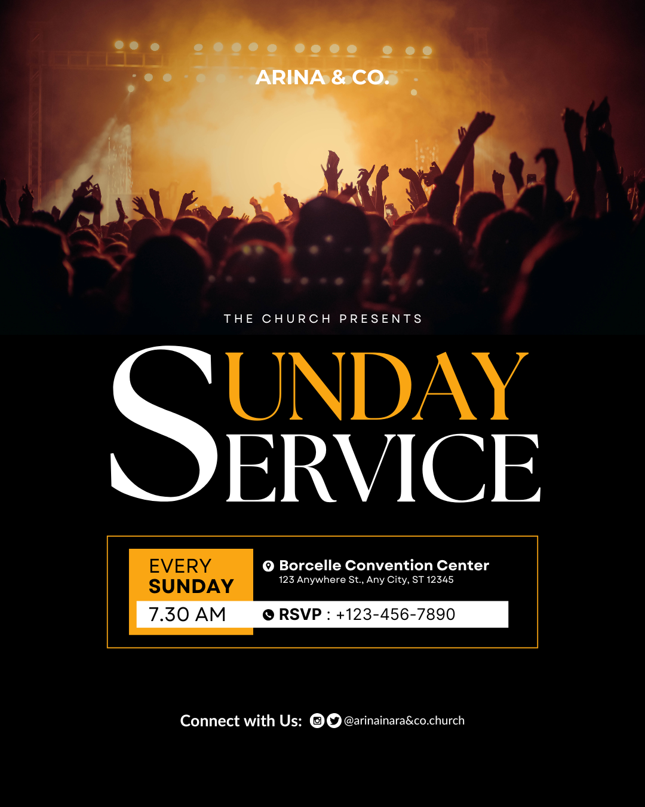

# Black and gold Sunday service — shared initial with framed logistics

- **ID:** church-service-003
- **Category:** Church and Worship
- **Subcategory:** Church Service
- **Tags:** Sunday service; warm crowd photograph; black/gold/white; shared-initial headline; display serif; recurring service; single service; framed logistics; overlapping panels; phone contact; social handle; no speaker portrait; no logo in reference.
- **Source:** user-supplied `Black Gold and White Bold Sunday Service Instagram Post.png`.
- **Editable source:** unavailable; flattened image only.
- **Status:** user-selected positive example; annotated from the image and the user's explanation. Suggested construction and optional additions are distinguished from visible evidence.
- **Asset reuse:** reference only; ownership and reuse permissions have not been recorded. Do not automatically reuse the photograph or depicted identity in new designs.

## Suitable brief and design character

A recurring Sunday-service announcement with one start time, venue, phone contact, and social connection details. Suitable when the atmosphere of a gathering is more important than an individual speaker portrait. A warm amber photograph, black information field, large serif typography, and restrained gold accents produce a bold, orderly composition.

## Composition and hierarchy

The upper photographic region is less than half the page, approximately two-fifths in this reference. It shows a crowd with raised hands under warm stage lighting; the exact event or setting is unverified. White identity text is centred near the top. The visible wording “ARINA & CO.” is example identity data, not a verified church name. No separate logo appears.

“THE CHURCH PRESENTS” sits near the photograph's dark lower transition, in small widely spaced uppercase text. The user treats this introductory line as optional.

The black lower region contains a large three-part title, then a framed logistics panel. The panel's outer left and right edges approximately align with the title group's visible left and right edges. Preserve this common alignment deliberately in a new layout; do not assume the source's pixel measurements are exact.

A centred “Connect with Us” group sits below with generous separation. The reference has social icons and a handle, but no separate website footer.

## Shared-initial headline recipe

Build the visible title using three editable text objects:

1. A large white **S** on the left spanning the height of both title rows.
2. Gold **UNDAY** on the upper right.
3. White **ERVICE** on the lower right.

The single S visually completes both words. Use a coherent display-serif family, with the two suffix rows at matching nominal size as the user's preferred recipe; exact original font and size values are unverified. Align the suffix rows on a shared left axis and tune their baselines and gap around the oversized S. Preserve clear readings of both “SUNDAY” and “SERVICE”.

Group the three objects as one title unit for movement and scaling. Keep the semantic title “Sunday Service” in the design brief or group metadata so checks understand the intentional shared letter rather than treating the suffixes as misspellings. The title treatment should not introduce a second visible S by accident.

Align the logistics frame to the optical bounds of the complete title, from the large S to the right edge of the lower word. Measure visible lettering rather than relying only on font boxes with internal side bearings. Do not distort letters to force the alignment.

This is a word-specific recipe, not a general instruction to remove initial letters from unrelated titles. Use a conventional title arrangement when the wording does not support a clear shared initial.

## Colour and imagery

Amber/gold accents relate to the photograph's warm lighting, with white text over black for most information. The title's gold suffix, gold frame, and gold recurrence block repeat the same accent family. Exact colour values are unverified.

The photograph communicates collective atmosphere and has a dark lower edge that meets the black information region. Preserve a readable area for the identity and introductory line. Do not assume the original image is a documented church gathering merely because it is used in a service poster.

## Logistics panel and layer relationships

The outer panel has a thin gold rectangular outline and a dark interior. The user proposes reduced fill opacity; the flattened reference does not establish whether the interior is transparent, partly opaque, or solid black. Keep the outline opacity independent from the fill so the border remains clear.

Inside the frame, a substantial gold rectangle on the left carries black “EVERY” and bold “SUNDAY” on separate lines. To its right, a location icon precedes the bold venue name, with a smaller address underneath.

A long white horizontal strip crosses in front of the lower part of the gold rectangle and extends across most of the panel. Its left portion carries the start time, placing it directly below the recurrence label. Its right portion contains a phone icon, the reference's “RSVP” label, and number. Keep the white strip above the gold block in layer order, and both behind their text and icons.

The date or recurrence and time must remain adjacent as one schedule group. Venue and address form a second group; phone label and number form a third. Use shared column anchors and deliberate internal padding so the layering remains organised, not arbitrary overlap.

## Content meaning

“Every Sunday” is a recurring schedule, not a missing date. Do not invent a calendar date for this variant. The visible time is a single start time.

The reference includes a venue name, address, phone number, and social handle. Treat every value as example data. Only use “RSVP” when the new brief actually requests reservations or responses; otherwise use an appropriate supplied contact label or simply the phone icon and number.

The social footer communicates ways to connect, not necessarily livestream availability. Do not reinterpret its icons as a promise of live broadcasts. Keep supplied phone numbers, handles, and URLs exact.

## User-preferred construction and optional additions

- **Photo and black region:** either crop the image into the upper region over a black page base, or place a full-page photograph behind an opaque black lower panel. Both can reproduce the visible division. Preserve the intended dark transition and do not let hidden background imagery reduce lower text contrast.
- **Logo:** when supplied, preferably centre it above the church name. Reserve room and move the identity group as needed. A logo is an adaptation, not a feature visible in this reference.
- **Introductory line:** “The Church Presents” may be included or omitted according to the brief. Rebalance the transition-to-title spacing when omitted.
- **Social footer:** include a supplied handle alongside relevant platform icons. The user accepts icons alone if no handle is provided; use only platforms indicated by the brief and do not invent accounts.
- **Alternative contact:** a supplied phone number can appear in the connection footer, including intentional repetition of the logistics contact. Repeat only when it helps and fits cleanly.
- **Website:** if supplied, add a separate centred line below the connection group with adequate bottom margin. No website is visible in the source.

## Adaptation rules

- **Specific date:** replace the recurrence block with a compact date group while retaining its proximity to the time strip. Verify consistency with the stated weekday.
- **Multiple service times:** expand the schedule structure or choose a larger logistics layout; do not squeeze additional entries into the original one-line time cell.
- **Long venue or address:** wrap within the venue column and increase panel height if needed, moving the contact strip accordingly. Avoid collisions and unreadably small type.
- **Long church name or added logo:** increase identity space and adjust the photo crop; protect readable margins around the top group.
- **Long phone number:** rebalance strip column widths or use a separate contact row. Preserve the full number rather than clipping it.
- **No phone:** remove the contact segment and rebalance the strip; do not leave an orphan phone icon or RSVP label.
- **No social/contact information:** remove the connection group and rebalance the footer whitespace.
- **Different headline:** use the shared-initial recipe only when it remains immediately understandable; otherwise use ordinary complete words.
- **Theme added:** allocate a deliberate subheading region and reflow the title-to-panel spacing. Do not hide it in unused photographic noise.
- **Different photograph or palette:** retain a deliberate relationship between the image's warmth or dominant colour and the accent, while ensuring contrast.

## Preserve and vary

Preserve the atmosphere/detail division, clear shared-initial reading when used, common title-and-panel boundaries, adjacent schedule information, aligned logistics groups, and restrained contact footer. Vary the image, accent, typography, proportions, and optional identity elements to fit the new brief. Do not require this layout for every recurring service.

## Quality checks

Inspect the rendered title at thumbnail size to confirm both words read clearly. Check the S-to-suffix spacing, suffix alignment, title/frame optical edges, gold-border visibility, and white-strip layer order. Ensure time and recurrence are perceived together, all text fits with padding, and the address remains readable. Verify exact supplied schedule and contact facts, appropriate RSVP wording, and intentional platform selection. Check any added logo or website for crowding and adequate margins.

## Evidence and uncertainty

The warm crowd photograph, black lower field, three-part title, gold outline and recurrence block, overlapping white strip, and contact footer are visible observations. Exact fonts, fill opacity, colour values, source-photo provenance, and original layer construction are unverified. The two background construction methods, optional logo, optional introductory line, icon-only footer, repeated number, and additional website are user-proposed adaptations rather than confirmed features of the source.
