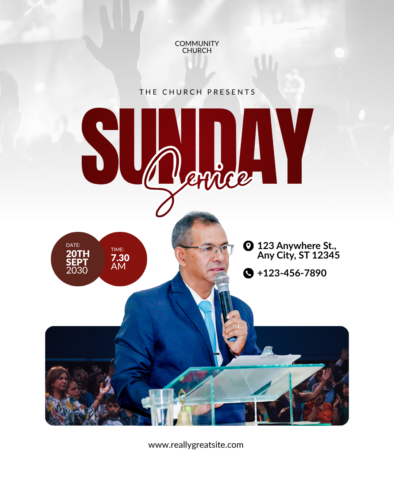

# White and maroon Sunday service — layered speaker with paired schedule circles

- **ID:** church-service-004
- **Category:** Church and Worship
- **Subcategory:** Church Service
- **Tags:** Sunday service; white/maroon; pale worship background; central speaker cutout; layered photographs; bold sans/script pairing; white outlined script; overlapping schedule circles; specific date; single service; venue and phone; website; no logo in reference; no speaker label in reference.
- **Source:** user-supplied `Red and White Simple Sunday Service Instagram Post.png`.
- **Editable source:** unavailable; flattened image only.
- **Status:** user-selected positive example, annotated from the image and user's explanation. Optional changes and inferred effect recipes are identified separately.
- **Asset reuse:** reference only; ownership and reuse permissions have not been recorded. Do not automatically reuse the depicted person, photograph, or identity in new designs.

## Suitable brief and design character

A light, speaker-led service announcement with one date/time pair, venue, phone contact, and website. The white field and faint photographic atmosphere keep the page open, while a large maroon headline and sharp foreground speaker provide emphasis. This is an alternative to dark, heavily coloured portrait compositions.

## Composition and hierarchy

A pale monochrome-looking worship photograph occupies the upper background and fades toward white. Raised hands remain visible as soft silhouettes rather than competing focal points. A small centred two-line church name sits above the optional widely spaced “The Church Presents” line.

Large, bold, condensed-looking “SUNDAY” anchors the upper-middle region. A maroon handwritten/script “Service” with a white outline overlaps its lower portion and descends toward the speaker. The outline separates the script from the large letters behind it.

A sharp central speaker cutout rises in front of a wide congregation photograph near the bottom. Two overlapping circular date/time badges sit to the speaker's left. Venue and phone, each with a black icon, sit to the right. Keep information in the negative space around the subject rather than on the face or hands.

The lower congregation photograph is framed as a wide rounded rectangle. The foreground speaker and lectern visually align with its lower boundary while extending well above it. A centred website sits below in the white footer. The source does not display a speaker name, title, or host/guest label.

## Typography, colour, and imagery

Use a heavy display sans-serif for the main title and a contrasting flowing script for the subtitle. Match their maroon/red family and give the script a white stroke wide enough to separate the overlap without closing letter counters. Keep both as editable text where supported; exact source fonts are unverified.

The user perceives the headline's centre as lighter and outer areas as darker, suggesting a subtle radial colour treatment. Record this as a desired optional effect, not a confirmed original gradient. If radial text fill is supported, use restrained lighter-centre/darker-edge maroons; otherwise a suitable solid maroon is preferable to an unsupported effect or loss of editability. Runtime radial-fill support has not been verified here.

Use black for identity, venue, phone, and website; white for text inside the dark warm-coloured circles. The two circles use related but distinguishable brown-maroon and red-maroon tones.

The visual composition has three image roles: faint upper worship atmosphere, foreground speaker, and lower congregation scene. It does not prove there were three separate original files or that the scenes depict the same event. A simpler two-asset adaptation may reuse a suitable worship image in the two background roles with separate crops/treatments, plus the supplied speaker cutout. Do not imply a documented relationship between independently sourced photographs.

## Functional decoration and suggested construction

- **Pale background:** the user's proposed recipe is a white base, desaturated worship photograph, reduced image opacity, and a fade into white. Desaturation settings vary by editor; use the value that actually produces monochrome, not an assumed numeric zero. Preserve the overall white appearance and text contrast.
- **Script outline:** white stroke around maroon script provides separation from the matching headline. Tune thickness on the rendered result.
- **Schedule circles:** two overlapping shapes group date and time. The left date circle visibly overlaps the right time circle; keep all text away from the overlap. Use a coherent size, gap/overlap, and text inset.
- **Lower photo panel:** clip the background congregation image to a wide rounded rectangle. Keep the foreground speaker on a separate layer above it, preserving hair, microphone, hands, and any retained lectern detail. Do not crop or mask away the upper speaker simply because the background has rounded corners.
- **Icons:** align location and phone symbols with their corresponding text blocks and retain a clear icon-to-text gap. A matching web icon before the URL is optional; it is absent from the reference.

## Content meaning

The source shows a specific date and one start time in separate adjacent badges. Date and time normally remain a single visual schedule group. Venue and phone form a separate practical-information group on the opposite side.

Use only the new brief's identity, schedule, venue, contact, and speaker facts. Check that a specific date agrees with a stated Sunday; do not inherit the source's example date or silently correct contradictory input. Never infer a speaker's name, role, or host/guest status from the image.

## User-preferred additions and alternatives

**Logo and introduction:** optionally centre a supplied logo above the church name. Reserve space and reflow the upper group. “The Church Presents” is optional; remove its unused space when absent.

**Speaker labels:** the user suggests an optional host/guest label in a clear area over the clothing, and a supplied title/name near the lower portrait region. These labels do not appear in the source. Preserve distinctions between an event role such as “Host”, an honorific such as “Pastor”, and the person's name; avoid redundant labels.

Differentiate role/title from name using size, weight, font, colour, or a small rectangular backing. Use only enough treatments to establish hierarchy. White text needs a sufficiently dark local background; maroon text needs contrast against the selected clothing or panel. Protect the face, microphone, hands, and other meaningful details. Move labels into a dedicated region if the portrait offers no readable space.

**Footer logistics alternative:** venue and contact may move to an organised footer above the website. With those side spaces freed, date may sit on one side of the speaker and time on the other. In this variant, give both schedule blocks matched visual styling and aligned placement so their relationship remains clear. This is a deliberate alternative to the default adjacent-date/time grouping, not a requirement to split them.

## Adaptation rules

- **Date and time supplied:** use the adjacent pair by default, with readable padding inside both circles.
- **Time only:** retain the time badge and rebalance the left region. Do not invent a calendar date.
- **Recurring Sunday explicitly intended, no date:** use “Every Sunday” as the schedule label. A missing date alone does not establish recurrence; retain uncertainty if the brief merely says “Sunday service”.
- **Date only, no time:** follow the user's preferred simplification: remove the time circle and its text, move the date into the vacated time position, and rebalance. Keep the remaining date badge if it suits the layout; do not leave an empty circle or duplicate date.
- **Neither supplied:** omit empty schedule elements and rebalance; do not fabricate logistics.
- **Long date/recurrence label:** wrap intentionally, enlarge the badge modestly, or use a compact non-circular schedule group instead of tiny type.
- **Long venue/contact:** widen or wrap the right-side block, or use the footer alternative. Preserve necessary directions and exact phone numbers.
- **Long speaker name:** allocate a dedicated label region, wrap deliberately, and adjust the lower image height or footer spacing. Do not shrink important identity text excessively.
- **Different speaker:** adapt side blocks to the actual silhouette and gesture. Keep a clean lower alignment with the image panel without stretching the person.
- **No second background photo:** use a suitable reused worship asset for atmosphere or simplify the lower panel. The design does not require three unique photographs.
- **No portrait:** choose a different recipe rather than leaving a large central gap.
- **No website:** remove the footer website and any accompanying icon; rebalance bottom space.

## Preserve and vary

Preserve the predominantly white canvas, subdued upper imagery, clearly readable contrasting title styles, central subject prominence, organised logistics, and deliberate lower photo/portrait relationship. Vary the warm accent, fonts, crops, optional labels, and logistics arrangement according to the brief. Avoid accumulating every optional badge and effect in one design.

## Quality checks

Inspect upper text against the pale photograph; check that the white background remains visually dominant. Verify title/script legibility and stroke thickness at thumbnail size, circle text clearance, schedule grouping, and contact-icon alignment. Check portrait cutout edges and lower alignment, avoiding visible rectangular cutout residue or accidental clipping. Confirm labels have local contrast and do not obscure the subject. Verify all supplied facts, date/weekday consistency, URL characters, and recurrence intent. Inspect added footer information for crowding and bottom margins.

## Evidence and uncertainty

Visible observations include the pale upper worship image, white page, maroon headline, outlined script, paired circles, central speaker with lectern, lower rounded congregation panel, right-side contacts, and website. Exact fonts, colour values, source-file count, layer construction, opacity, and gradient settings are unverified.

Desaturation and opacity adjustments, radial title fill, separate image compositing, optional logo, speaker labels, web icon, and rearranged footer logistics are user-proposed interpretations or adaptations. Their editor implementations require separate verification when generation is built; this entry does not add runtime capabilities.
