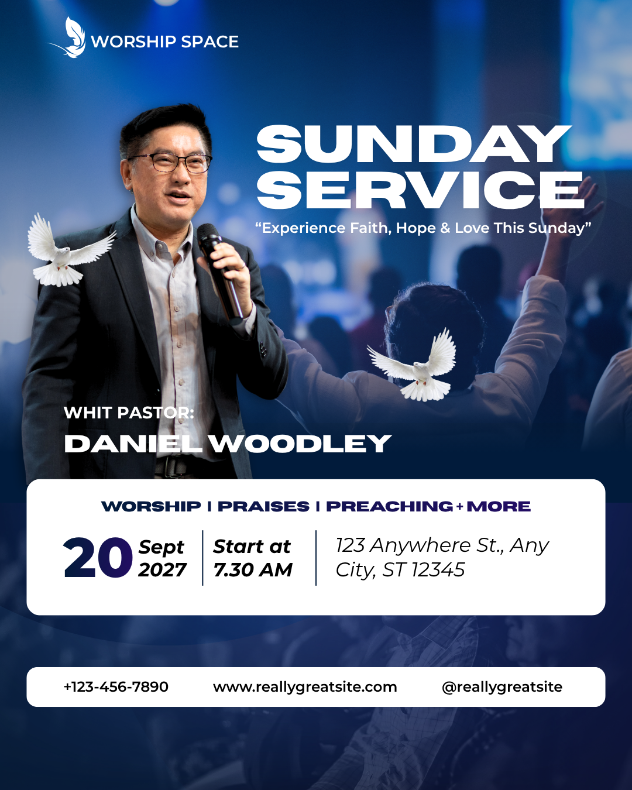

# Blue Sunday service — left speaker with white logistics and contact cards

- **ID:** church-service-005
- **Category:** Church and Worship
- **Subcategory:** Church Service
- **Tags:** Sunday service; blue worship background; left speaker cutout; right headline; matching bold title fonts; optional theme; white rounded cards; large day number; three-column logistics; contact strip; logo/name group; optional doves.
- **Source:** user-supplied `Blue and White Modern Sunday Service Instagram Post (1).png`.
- **Editable source:** unavailable; flattened image only.
- **Status:** user-selected positive example, annotated from the image and user's explanation. Optional changes and inferred techniques are identified separately.
- **Asset reuse:** reference only; ownership and reuse permissions have not been recorded. Do not automatically reuse the depicted speaker, logo, or photographs.

## Suitable brief and design character

A speaker-led service announcement with an optional theme, date and start time, venue, and multiple contact channels. Blue photographic atmosphere and large white lettering create impact; two white rounded cards provide clean, readable areas for practical information. The asymmetric portrait/title arrangement distinguishes this from a centred-speaker design.

## Composition and hierarchy

A white logo and “WORSHIP SPACE” identity appear as a horizontal group in the upper-left. The logo is to the left of the name in the source. Treat the wording as example identity data. A centred or stacked logo/name arrangement is a user-accepted alternative when the space is rebalanced.

The speaker cutout occupies the left side, while “SUNDAY” and “SERVICE” form two large left-aligned rows on the right. Both words use the same bold, broad sans-serif style. A smaller theme/invitation line immediately below shares the title area's left anchor.

The speaker label and larger name appear in the lower-left of the portrait region, above the logistics card. They are white and read over the dark clothing/background. The source's label reads “WHIT PASTOR:”, an apparent wording error; do not carry it into new designs.

A large white rounded rectangle spans most of the page width below the portrait/title region. Its optional programme heading sits above three columns: date, start time, and venue. Two thin vertical separators mark the column boundaries. A second, shallower white rounded rectangle below contains phone, website, and social handle. Align both cards to common outer left and right margins.

The worship photograph remains visible around and beneath these regions, with a deep blue lower treatment. Subtle curved/translucent-looking blue regions appear near the lower portion; they are optional tonal decoration, not essential information containers.

## Typography, colour, and imagery

Use matching bold sans-serif styles for the two title lines. Exact font families are unverified. The theme is smaller and lighter in visual weight, but must remain clearly readable against the photograph. Do not manufacture invitation copy simply to fill this position.

The name is prominent, with the role label smaller. The user favours clear role/name differentiation through font, weight, or size. The source appears to use related bold sans-serif lettering; distinct original font families are not confirmed. Keep visual consistency with the title without making every text element equally dominant.

The date uses an oversized day number beside smaller stacked month and year. The time uses a small introductory label above a stronger time value. Venue wording has its own aligned block with more horizontal room. Dark navy/purple-toned heading and date accents, plus black body text, contrast with the white card.

The background shows worship-like raised hands and a blue atmosphere. The user proposes a blue base with reduced-opacity photography so the base colour influences the image. Tinting or overlays could also produce the visible result; original settings are unknown. Keep background activity subordinate to the title, theme, and speaker. Preserve the foreground speaker's clarity and natural appearance.

## Functional decoration

- **White cards:** separate detailed information from the busy photograph; rounded corners repeat a coherent container style.
- **Column dividers:** distinguish date, time, and venue without breaking their overall logistics grouping. Dividers should correspond to actual content columns.
- **Doves:** two white dove images are visible, one near the speaker's left shoulder and another in the centre-right open area. The user treats them as optional. Use such imagery only when it supports the brief and balance; empty space does not require an ornament. Protect faces, hands, microphones, text, and identity marks from obstruction.
- **Optional theme backing:** the source theme has no white card. The user suggests a white rounded backing as an alternative for readability. If used, switch the theme to a dark contrasting colour, give it padding, and align it with the title region.
- **Optional contact icons:** phone, globe/web, and relevant social icons can precede their values. The source contact strip contains text only. Use consistent scale, tint, baseline/visual alignment, and gaps; centre each icon/value group within its allocated column.

## Content meaning and corrections

Treat all displayed identity, date, time, speaker name, address, URL, and handle as example data. For new designs, use the exact supplied facts. Check that a specific date agrees with the stated weekday rather than copying this example's date.

Separate the person's event role (Host, Guest, Speaker, or Ministering) from their honorific (Pastor, Reverend, or a supplied abbreviation) and name. For example, a supplied brief could produce “HOST” above “Pastor [Name]”. Use the actual requested title and spelling; avoid redundant strings such as “Pastor Pastor”. Never infer the person's real identity or role from appearance.

The source's “WHIT PASTOR:” should not become a reusable label. For fresh generation, use a clean brief-supported label. Faithful transcription of the reference should retain awareness of the source typo rather than pretending it says something else.

The line “WORSHIP | PRAISES | PREACHING + MORE” is an optional programme summary. Include only activities supplied or authorised by the brief. The theme is likewise optional. The contact handle does not identify every platform on its own; only add platform icons when those platforms are specified. These icons indicate contact presence, not necessarily livestream availability.

## Adaptation rules

- **No theme:** omit the line and rebalance the title/portrait whitespace; do not insert generic filler.
- **Long theme:** wrap within the title region or use the optional padded backing. Reserve height and keep it clear of the speaker and other details.
- **Alternative shared-S headline:** the user accepts the shared-initial treatment from Reference 003 as an option. Use it only if it fits this title region and remains readable; reflow the theme rather than forcing the original dimensions.
- **Recurring Sunday explicitly intended:** replace the day/month/year cluster with small “Every” and prominent “Sunday”. Missing date alone does not establish recurrence.
- **No date, time supplied:** use time and venue as two columns with one separator; omit the date column and redistribute width.
- **No time, date supplied:** use date and venue as two columns with one separator. Do not invent a start time.
- **Only one logistics field:** use a single readable region without orphan separators. Missing fields must not leave empty columns.
- **More service times:** expand the schedule portion into a grouped list and adjust the card height rather than cramming rows into the original time cell.
- **No programme summary:** remove its row and reduce/rebalance card height while preserving padding.
- **Long venue:** allocate more width, wrap deliberately, or increase card height. Keep essential address information and readable type.
- **Long name or different portrait:** reflow the name and adjust its backing/position as needed. Preserve the face, microphone, hands, and meaningful gesture; do not keep fixed coordinates at their expense.
- **Fewer contact fields:** redistribute available columns; remove unused labels and icons. Never invent a handle, phone, or website.
- **Long contact values:** wrap or use separate rows while keeping actual URL/phone characters intact. Preserve equal outer card margins.
- **No doves:** leave deliberate negative space or rebalance the photograph; do not substitute arbitrary decoration automatically.
- **No speaker:** select a different recipe, since this arrangement relies on the left-side subject balancing the title.

## Preserve and vary

Preserve the asymmetric speaker/title balance, readable theme placement, differentiated speaker role/name, grouped date/time/venue, and shared margins of the two white cards. Vary the photograph, blue tone or compatible palette, fonts, optional theme backing, and restrained decoration. Optional features should be selected for the brief rather than accumulated.

## Quality checks

Inspect title and theme contrast over the photo, portrait clearance, role/name wording, and card padding. Check that date/month/year form one legible unit, separators match populated columns, and venue text stays inside its region. Validate date/weekday consistency and all supplied contact facts. Verify optional theme-card text contrast and contact-icon alignment. Ensure doves, if retained, have clean edges and do not obscure information. Check the final result at full size and thumbnail size.

## Evidence and uncertainty

The logo/name placement, left speaker, right two-line headline, theme, doves, label typo, date hierarchy, white cards, separators, and text contact strip are visible observations. Exact fonts, blue treatment, opacity, underlying source assets, and layer geometry are unverified.

The base-colour/opacity method, alternate logo placement, shared-S title, corrected event-role labelling, recurring-date treatment, optional theme card, and contact icons are user-proposed recipes or adaptations. They do not establish the source's original construction or verified runtime support in the editor.
