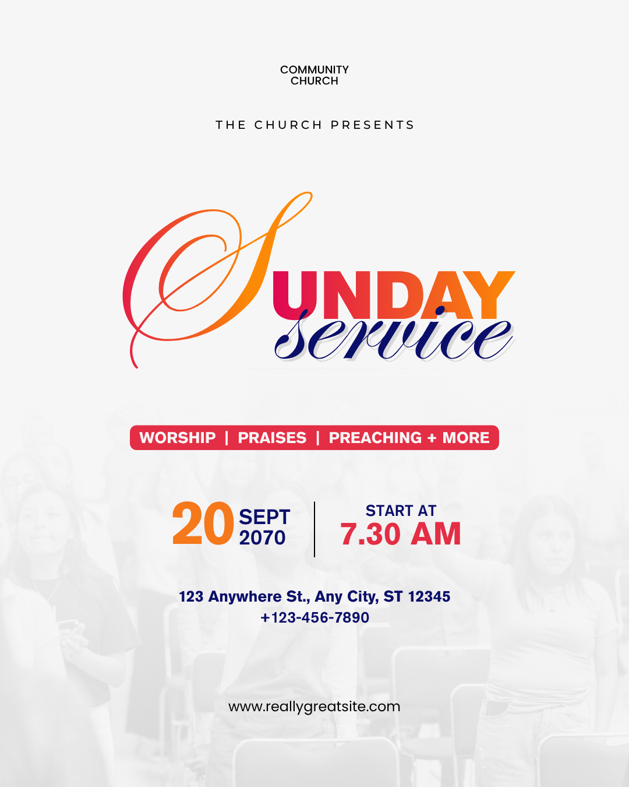

# Pink and orange Sunday service — expressive initial with minimal schedule

- **ID:** church-service-006
- **Category:** Church and Worship
- **Subcategory:** Church Service
- **Tags:** Sunday service; typography-led; no featured speaker; white background; faint congregation photograph; gradient initial; script/sans pairing; pink-orange-navy palette; theme/programme band; two-column schedule; centred venue/contact; optional additional services.
- **Source:** user-supplied `Pink and Blue Typographic Sunday Service Instagram Post.png`.
- **Editable source:** unavailable; flattened image only.
- **Status:** user-selected positive example, annotated from the image and user's explanation. Inferred techniques and optional adaptations are distinguished from observations.
- **Asset reuse:** reference only; ownership and reuse permissions have not been recorded. Do not automatically reuse the photograph or identity.

## Suitable brief and design character

A simple service announcement without a featured preacher, speaker name, or portrait. Expressive typography provides the focal point, while a faint congregation image gives atmosphere without replacing the white page. Suitable for a date/time, venue, contact, and optional theme or additional service information.

## Composition and hierarchy

A small centred church name appears near the top, followed by a widely spaced optional “The Church Presents” line. No logo is visible. Generous whitespace separates this identity group from the main title.

The title combines a large calligraphic S on the left with bold uppercase UNDAY on the right and navy script “service” beneath the suffix. The script word includes its own s: unlike Reference 003, the oversized initial is only the first letter of Sunday, not a shared letter completing both words. Group the title as one composition while keeping its three text components editable and retaining the semantic wording “Sunday Service”.

A slim pink/red rounded band beneath the title contains programme wording. Below it, the centred schedule has two columns separated by a thin dark vertical line: day/month/year on the left and start label/time on the right. Venue and phone are centred beneath the schedule. The website is a separate, quieter line near the bottom.

A very pale congregation photograph occupies the lower background, fading upward into the white field. There is no isolated foreground speaker. Preserve the white-space-led character rather than filling every gap.

## Typography and palette

The large S and “service” use visually related flowing calligraphic styles; the user prefers matching their font family. Exact original families are unverified. UNDAY uses a heavy sans-serif, contrasting with the thin expressive curves.

The S and UNDAY move from pink/red toward orange/golden tones from left to right. Use a coordinated gradient across the title composition, considering the overall colour progression rather than independently restarting an unrelated gradient on every text object. Exact colours and original gradient coordinates are unverified. Keep the lettering editable where supported.

“service” is dark navy with a subtle light-grey offset/shadow-like treatment visible behind it. This optional accent should remain restrained; it is not evidence of 3D extrusion.

The oversized day is orange, the prominent time pink/red, and the month, year, start label, venue, and phone navy. This controlled distribution repeats the headline palette and distinguishes schedule values from supporting labels. The website uses simpler black text. Preserve contrast, particularly if substituting a lighter yellow for orange on white.

The programme band uses white bold text on pink/red, with rounded corners and deliberate padding. The source reads “WORSHIP | PRAISES | PREACHING + MORE”; it is programme copy, not an explicitly supplied event theme.

## Background construction and uncertainty

The user suggests a desaturated photograph over white with greatly reduced opacity. This is a suitable recipe for the visible pale, near-monochrome result. Use low **nonzero** image opacity: zero opacity would hide the photograph completely. Use the editor's actual monochrome/desaturation control rather than assuming numeric zero means no colour. A white overlay and an upward fade are alternative ways to achieve the appearance; the source layer stack is unknown.

Keep recognisable but subdued congregation details at the bottom and a quiet white area around the headline. Background contrast must not compete with logistics or footer text.

## Functional decoration and optional additions

- **Expressive initial:** provides the main visual flourish; no separate decorative artwork is necessary.
- **Rounded band:** groups an optional theme or supplied programme summary. A shape behind editable text is an appropriate implementation. Do not automatically include both theme and programme in an undersized band.
- **Schedule separator:** distinguishes the two populated columns while keeping them one schedule group. Remove it when only one group remains.
- **Logo:** when supplied, the user prefers it centred above the church name. Allocate space and reflow the identity instead of crowding the top.
- **Icons:** location, phone, and website icons may be added before their respective values. None is visible in the reference. Use consistent scale, dark tint, spacing, and alignment; centre the combined icon/text groups.

## Content meaning

Use only the new brief's church name, schedule, address, phone, URL, theme, or programme. The source's dates and other text are example data. Check specific date/weekday consistency rather than copying the example year or silently changing supplied facts.

There is no featured speaker information to invent. An absent theme can mean omission of the band, or retention of an actually supplied programme summary. Do not generate generic worship activities merely to fill this region.

## Adaptation rules

- **Theme supplied:** replace the programme wording with the actual theme. Wrap or increase band height for longer wording, with readable padding.
- **No theme or programme:** remove the band and rebalance title-to-schedule spacing.
- **Date and time supplied:** preserve their adjacent two-column grouping, oversized day, and smaller month/year.
- **Recurring Sunday explicitly intended:** replace the calendar cluster with a compact “Every Sunday” group. Missing date alone does not establish recurrence.
- **Only date or only time:** remove the absent column and separator; centre the remaining schedule group.
- **Neither supplied:** omit empty schedule placeholders and rebalance without inventing facts.
- **Additional services:** the user proposes placing supplied first-service, second-service, or midweek details between the existing logistics and website. Use simple, readable black text in the visual style of the website, with aligned schedule rows. Keep each service label next to its own day/time. Move the website downward within a safe bottom margin and reflow earlier regions if needed; do not duplicate or contradict the main service time.
- **Long venue or phone:** wrap deliberately or increase allocated height before reducing text excessively. Preserve exact details.
- **No website or phone:** remove that group and any icon, then rebalance the footer.
- **Long church name or added logo:** adjust identity height and whitespace while preserving the headline's prominence.
- **Different title:** use a normal full-word composition if a separated decorative initial becomes ambiguous. Never mistake this for the shared-S recipe.
- **Different palette:** preserve a small coherent accent set, dark supporting text, and sufficient contrast against white. Gradients should support the typography rather than impair readability.
- **No photograph:** retain the white background and rebalance; this typography-led design does not depend on a speaker or decorative image.

## Preserve and vary

Preserve the predominantly white page, expressive but readable title, restrained accent distribution, compact schedule, and clear footer hierarchy. Vary the fonts, gradient endpoints, background crop, optional band, and number of supplied schedule rows. Negative space is intentional and need not be filled with additional ornament.

## Quality checks

Read the title at thumbnail size: confirm the large S completes UNDAY and that service remains a complete word. Inspect gradient continuity, script overlap, optional shadow restraint, and accent contrast on white. Verify the background remains faintly visible without compromising text. Check band padding, schedule alignment, divider use, accurate date/weekday and service associations, and exact contact values. Ensure added service rows leave readable gaps and a safe website bottom margin.

## Evidence and uncertainty

Visible facts include the white field, faint lower photograph, large gradient initial and suffix, navy script subtitle, pink programme band, two-column schedule, centred venue/phone, and plain website. Exact fonts, gradient parameters, opacity, desaturation, and original asset construction are unknown.

Matching the S/script font, desaturation and low-opacity recipe, optional logo/icons, replacement theme, and expanded service-information region are user preferences or suggested implementations. They do not establish new editor capabilities or the source's original settings.
