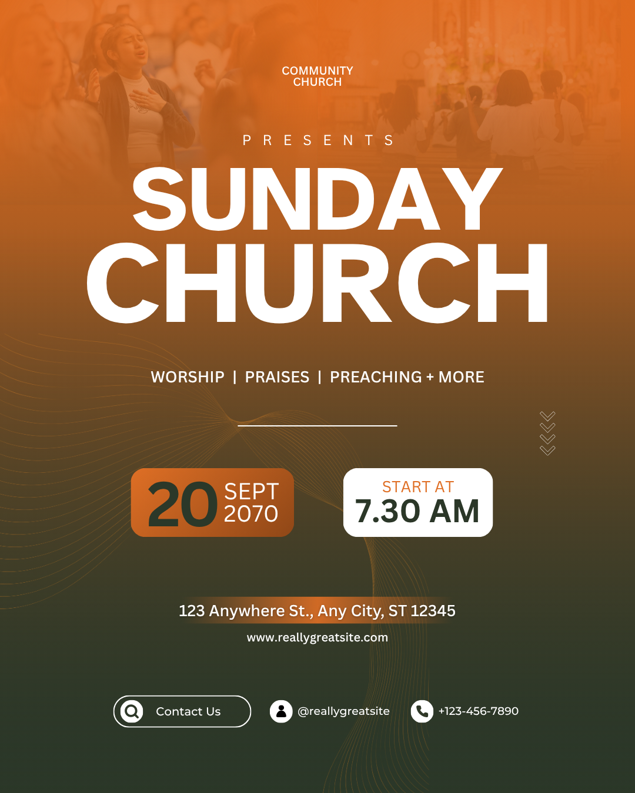

# Orange and olive Sunday service — gradient field with contrasting schedule cards

- **ID:** church-service-007
- **Category:** Church and Worship
- **Subcategory:** Church Service
- **Tags:** Sunday service; no featured speaker; orange-brown-olive gradient; subdued upper worship imagery; stacked bold headline; optional theme; contrasting schedule cards; large day number; optional contour lines; downward chevrons; venue backing; contact footer.
- **Source:** user-supplied `Orange Modern Sunday Church Instagram Post.png`.
- **Editable source:** unavailable; flattened image only.
- **Status:** user-selected positive example, annotated from the image and user's explanation. The source headline and icons are distinguished from the user's preferred adaptations.
- **Asset reuse:** reference only; ownership and reuse permissions have not been recorded. Do not automatically reuse the photographs or identity.

## Suitable brief and design character

A general church-service announcement without a featured speaker. A full-page warm-to-dark gradient, broad white title, paired schedule cards, and simple footer provide a strong composition with restrained practical information. Orange/brown, dark olive green, and white repeat across the page instead of introducing unrelated accent colours.

## Composition and hierarchy

The background transitions vertically from orange at the top through brown to deep olive green at the bottom. Subdued worship imagery is visible across the upper region behind a small centred two-line church identity and widely spaced “Presents”. No separate logo is visible. The upper imagery appears to contain different gathering views; the flattened image cannot establish the original asset count.

The source headline reads “SUNDAY” over “CHURCH” in large bold white sans-serif lettering. The lower word is larger/wider; Sunday is relatively smaller but remains prominent. The user wants this recipe to generate **“Sunday Service”** instead. Treat that as an authorised adaptation, not proof that “Sunday Church” is inherently incorrect or a faithful transcription of the image. Fit SERVICE deliberately rather than keeping CHURCH's exact geometry.

A centred programme line follows the title, then a short thin white horizontal rule. The line can become a supplied theme. Two rounded schedule cards sit side by side beneath: date on the left, start time on the right. Align their top/bottom edges and preserve a deliberate gap.

The venue is centred on a narrow warm-toned backing below the cards, with the website immediately underneath. A final contact row contains an outlined “Contact Us” capsule, an account/handle group, and a phone group. Preserve clear separation between schedule, location, website, and contact regions.

## Typography and colour relationships

Use one coherent bold sans-serif style for the stacked title, with a clear size hierarchy and ample side margins. Exact source fonts and colour values are unverified. White carries most title and supporting text over the gradient.

The left card has an orange-to-brown-looking fill, a very large dark-green day number, and smaller white month/year beside it. The right card is white, with a small orange “Start At” label above a large dark-green time. The two cards repeat and exchange the same palette roles rather than using identical fills. Check contrast when tuning these colours; matching the palette alone does not guarantee readability.

Venue and footer text are smaller and simpler than the schedule. Maintain a compact date unit and a compact time unit, using actual text measurement and generous card padding.

## Background and functional decoration

- **Photographic treatment:** the user proposes a gradient base behind reduced-opacity worship imagery so the base colour remains visible. Tinting or overlays could also create the source appearance. Preserve subdued imagery and strong title contrast; original opacity and construction are unknown.
- **Fine curved line artwork:** low-contrast warm contour/wave lines sweep from the left across the middle and toward the bottom. Their source could be an image, vector, or procedural pattern; this cannot be inferred from pixels. They are optional. Omit them when they compete with content; do not invent a need for decorative filler.
- **Horizontal rule:** a short centred white line separates the theme/programme region from the schedule area. Preserve deliberate spacing; it is decorative separation, not an interactive control.
- **Downward chevrons:** a small vertical stack of fine light chevrons appears to the right of the rule. The user accepts repeated `>` glyphs rotated to point downward as an editable approximation. Rotate the glyphs appropriately and inspect the result; align and space the stack consistently. These are optional directional decoration, not a button.
- **Venue backing:** a shallow warm-toned, soft-ended strip supports white address text. The user accepts a brown or glass-like translucent backing. A glass effect is a proposed alternative, not confirmed in the source; use a simple translucent shape if that is what the renderer supports. Keep the text opaque and readable.

## Content meaning and user-preferred corrections

Use the actual new brief's identity, date, time, venue, website, and contacts. All visible source values are example data. Check that supplied calendar dates agree with any stated weekday; do not copy the source year by default.

The programme wording “Worship | Praises | Preaching + More” may be replaced with a supplied theme. Do not invent activities or a theme to fill the line. “Presents” may be omitted when unnecessary.

The source's “Contact Us” capsule uses a magnifying-glass/search symbol. For new designs, follow the user's preference for a relevant contact/phone symbol or plain text instead. The capsule outline is optional; no enclosure is needed merely to match the reference.

The handle appears beside a generic person/account icon, not identifiable social-platform icons. The user wants relevant social icons as an alternative. Use only platforms supplied by the brief; a generic handle alone does not establish platform membership. The actual phone number has its own phone symbol in the source. Do not reinterpret contact icons as livestream availability.

## Adaptation rules

- **Logo supplied:** optionally centre it above the church name; reserve height and reflow the identity group.
- **Sunday Service wording:** use complete editable SUNDAY and SERVICE text, adjusting size and spacing to suit their widths. The source wording is retained only as source evidence.
- **Theme supplied:** place it in the programme region. Wrap or allocate more height for a long theme rather than reducing it to unreadable type.
- **No theme/programme:** omit that row and rebalance the rule and schedule spacing.
- **Recurring Sunday explicitly intended:** replace the date cluster with “Every Sunday”. Missing date alone does not establish recurrence.
- **Only date or only time:** remove the unused card and centre/rebalance the remaining schedule. Do not create placeholder facts.
- **Several services:** replace the single-time card with an aligned schedule or allocate more height; keep each service label beside its time.
- **Long venue:** increase backing width/height within margins and wrap deliberately. Add a location icon if useful; centre the combined icon/text group and preserve necessary directions.
- **Optional website icon:** add a matching icon beside the supplied URL only when useful, with consistent scale and spacing.
- **Fewer contact fields:** remove empty groups and redistribute the row. “Contact Us” need not remain if it adds no useful information.
- **Long phone/handle:** wrap into deliberate rows or widen its region rather than clipping or changing characters.
- **No decorative lines or chevrons:** retain the gradient and intentional whitespace; the information layout works without them.
- **Different palette or image:** preserve a coherent three-role palette, contrasted card fills, and readable text. Keep the upper image subordinate to the headline.

## Preserve and vary

Preserve the vertical colour progression, bold stacked title, coordinated but contrasting date/time cards, centred location/website, and orderly contact region. Vary the gradient hues, photography, optional line art, icon treatment, and theme content to suit the brief. Do not make decoration or the contact capsule mandatory.

## Quality checks

Inspect white title contrast across the upper imagery and gradient. Check SERVICE fits without clipping after replacing the source word. Verify card alignment, padding, large-day readability, month/year grouping, and time contrast. Check that contour lines do not cross text distractingly and chevrons point downward. Confirm optional translucent venue backing actually improves readability. Validate date/weekday consistency, supplied contacts, correct contact symbols, and meaningful platform selection. Inspect bottom margins and footer wrapping at the intended display size.

## Evidence and uncertainty

Visible evidence establishes the gradient appearance, subdued upper imagery, source SUNDAY CHURCH headline, programme line, decorative curves/chevrons, contrasting cards, venue strip, website, and contact groups. Exact opacity, fonts, colours, asset count, and original layer construction are unknown.

Sunday Service wording, optional logo, replacing programme with theme, rotated keyboard chevrons, location/website icons, glass-like venue backing, corrected contact icon, and unenclosed contact layout are user-authorised adaptations. Editor support for specific effects remains a separate implementation concern.
