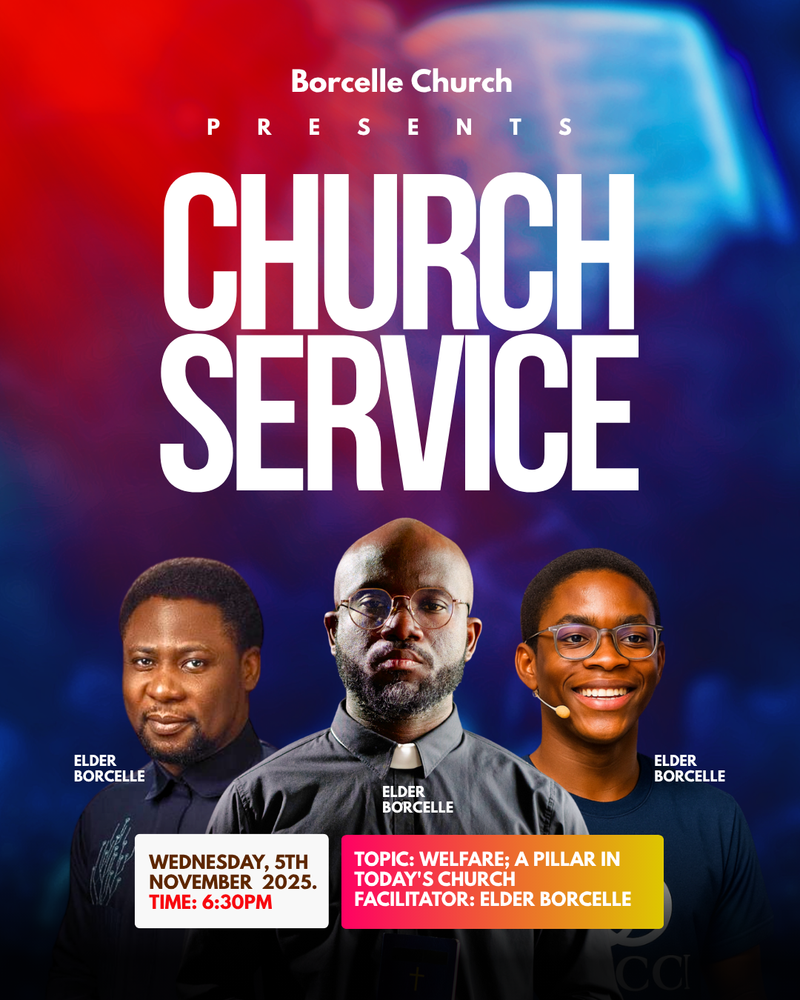

# Red and blue church service — three-person host and guest composition

- **ID:** church-service-008
- **Category:** Church and Worship
- **Subcategory:** Church Service
- **Tags:** weekday church service; three-person composition; central host; two side guests; overlapping cutout portraits; face-safe layering; aligned stacked headline; condensed sans-serif; red-blue atmospheric background; date-and-time card; theme-and-facilitator card; optional logo; optional presents line; optional footer.
- **Source:** user-supplied `Red and Blue Dynamic Church Service Instagram Post.png`.
- **Editable source:** unavailable; flattened image only.
- **Status:** user-selected positive example; annotated from the image and the user's explanation. Visible source features, user preferences, and inferred construction are distinguished below.
- **Asset reuse:** reference only; ownership and reuse permissions have not been recorded. Do not automatically reuse the depicted people, photograph, or church identity.

## Suitable brief and design character

A bold church-service announcement featuring a host or facilitator and two guests, especially for a weekday service with a date, time, topic or theme, and optional facilitator details. The composition communicates roles visually: the central host is larger and in front, while the guests remain clearly visible on either side. The mood is energetic, modern, direct, and speaker-led without requiring much supporting copy.

This is a general **Church Service** family, not a Sunday-only recipe. Use the exact supplied event title and weekday. Wednesday in the source is example content, not a reusable default.

## Composition and hierarchy

A soft-focus red, magenta, cyan, and deep-blue photographic field fills the background. The brightest blurred shapes are concentrated near the top, while the lower region becomes darker navy so portraits and information cards remain legible. The source appears atmospheric rather than documentary; the flattened image cannot establish the original photograph, overlays, blur settings, or gradient stack.

The centred identity group begins with the church name. If a real logo is supplied, the user prefers it above the church name, with enough reserved height that the remaining content does not become crowded. Widely tracked “PRESENTS” follows as an optional introduction and may be removed entirely.

The dominant title is two stacked lines: “CHURCH” and “SERVICE”. Both are very large, white, uppercase, tightly set condensed sans-serif text. Treat the two lines as one measured headline block. Their visible left edges should align, their visible right edges should align, and the line gap should be very small without allowing glyphs to collide. Match width through font selection, font size, and measured tracking; do not distort letters merely to force equality. For different wording, create deliberate line breaks and optical alignment instead of blindly reproducing these coordinates.

Three cutout portraits bridge the lower edge of the headline and the information area. The host occupies the centre foreground, starts slightly higher, appears somewhat larger, and overlaps the inner portions of both guests. The two guests sit behind and toward the left and right edges. Their outer shoulders can extend toward or beyond the page edges, but all three faces must remain fully visible. Overlap may cover part of a guest's shoulder or lower torso; it must not cover eyes, mouth, or other identity-defining facial areas.

The portraits should feel like one ensemble rather than three unrelated rectangles. Align their perceived ground line, tune crop scale by visible head/torso size rather than source-image dimensions alone, and inspect the actual render. Similar head heights are not required: the central host's larger scale is the intended role signal. Preserve natural body proportions and do not stretch any source.

Small role/name labels sit close to their corresponding portraits in available shoulder-side negative space. The central label may overlap the host's clothing if contrast is strong. Keep every label unambiguously associated with the correct person and never infer names or roles from appearance.

Two rounded information cards sit across the lower portrait area, above the people in z-order. The narrower left card contains the date and time. The wider right card contains the topic/theme and optional facilitator. Unequal widths are functional: long theme wording needs more room. Cards may cover lower torsos, but never faces or important gestures, and their opaque or high-contrast backing must keep all wording readable.

## Typography, colour, and imagery

The source uses a very tall, heavy condensed display sans-serif for the headline and simpler bold sans-serif text elsewhere. Exact fonts are unknown. The headline's scale and disciplined alignment provide most of the visual character; supporting text should not compete with it.

White is the principal headline and speaker-label colour. The left logistics card is white with dark brown date text and red time text. The right card uses a horizontal hot-pink/red through orange to yellow gradient with white text. These card accents echo the warm red/magenta background while contrasting with the surrounding navy. Preserve the principle of a restrained cool background plus warm functional accents; the exact source colours are optional and should adapt to supplied identity colours and portrait clothing.

Use clean portrait cutouts when available. Keep skin tones natural and separate each silhouette from the blue/red field with contrast, restrained rim light, or a subtle shadow only when necessary. Do not apply a strong colour wash that makes faces difficult to recognise. Different portrait lighting may need gentle tonal balancing, but avoid making the people look artificially identical.

## Functional decoration

- The blurred red/blue background creates energy and provides light/dark zones without adding literal scene details that compete with the speakers.
- Wide tracking on the optional “PRESENTS” line creates breathing room between the identity and oversized headline.
- Tight headline stacking turns two words into one dominant rectangular block.
- Portrait scale and z-order communicate host-versus-guest roles before the labels are read.
- Rounded cards separate logistics from the people and give date/time and theme different information capacities.
- The warm gradient on the wider card attracts attention to the theme while repeating the poster's warm accents.
- A dark lower fade helps the portraits terminate cleanly at the page edge and can support an optional footer.

Every decoration has a hierarchy or readability purpose. Do not add ornamental shapes merely to fill the remaining background.

## Content meaning

The source includes a church name, optional “Presents”, the event title, three example person labels, a Wednesday date, one start time, a topic, and a facilitator. All are example facts only. Future posters must use the new brief's exact church, event title, weekday, date, time, names, roles, theme/topic, facilitator, venue, website, and contacts.

The topic region can hold a supplied theme instead. “Topic”, “Theme”, and “Facilitator” are meaningful labels only when the brief supplies that content. Do not invent a topic, facilitator, guest, or host to populate the design.

An optional venue, website, and contact group may be placed beneath the two cards or in a deliberately reserved bottom footer. Reserve this space from the beginning and move the cards upward if necessary; do not clip the footer against the canvas edge or lay it over visually busy clothing without a backing.

## Adaptation rules

- **Logo supplied:** centre it above the church name, keep it fully visible without cropping, and reflow the identity/title group downward only while the headline and portraits retain enough room.
- **No logo:** let the church name begin the identity group; never synthesize a mark.
- **No “Presents”:** remove it and close the gap deliberately rather than leaving an unexplained empty row.
- **Three portraits:** use the supplied host as the larger centre foreground subject and guests as smaller side subjects. Preserve every face and map each label to the correct image.
- **Roles not specified:** do not guess which person is host. Use equal or near-equal prominence, follow an explicit ordering supplied in the brief, or request clarification in a workflow that supports it.
- **Two portraits:** use a balanced pair with slight size emphasis only when one is explicitly the host/facilitator. Re-centre the ensemble and information cards.
- **One portrait:** feature the supplied person centrally or asymmetrically and reclaim side space for theme/logistics. Do not create imaginary guests.
- **No portraits:** choose a typography-led variation and enlarge or reposition the information region. Do not leave three empty portrait slots.
- **Different portrait proportions:** size from the rendered face and torso, not only the bounding boxes. Use contain-style fitting without stretching, then adjust boxes and overlap around the actual silhouettes.
- **Long names or roles:** place labels in clear nearby space, wrap deliberately, or use a separate aligned name strip. Never shrink labels until they are unreadable or place one label nearer the wrong person.
- **Different weekday:** display exactly the supplied weekday and date. This recipe supports Wednesday and other weekday services as well as Sunday.
- **Recurring service:** replace the specific date only when recurrence is explicit, for example “Every Wednesday”. A missing date does not prove recurrence.
- **Long date/time:** increase the left card's width or height and rebalance the pair. Keep date and time visually distinct and verify weekday/date consistency.
- **Long topic/theme:** allow the right card more width or height, wrap by meaning, and keep label/value relationships clear. Move facilitator information to a separate line or footer if needed.
- **No topic/theme:** remove that content and resize or repurpose the wider card only for other supplied information; never insert filler.
- **Venue, website, or contacts supplied:** reserve a readable footer below the cards, optionally with relevant semantic icons. Use only supplied platforms and exact contact characters.
- **Different palette/background:** preserve strong white-title contrast, a darker portrait region, and coherent warm/cool colour roles. Keep the background subordinate to faces and text.
- **Different event title:** align the stacked lines optically as one block, but do not force equal width when distortion or extreme tracking would harm readability.

## Preserve and vary

Preserve the single dominant aligned headline block, visually communicated host/guest hierarchy, face-safe portrait overlap, readable person associations, unequal logistics/theme card capacities, and strong warm/cool contrast. Vary the background image, palette, typeface, portrait count, optional identity elements, card proportions, and footer content to suit the supplied brief.

Choose another family when the brief contains many schedule rows, long directions, extensive programme details, or more people than can remain identifiable at the target size. The strength of this recipe is a concise message and a carefully organised small speaker group.

## Quality checks

Inspect the final rendered poster at full size and thumbnail size. Confirm that the two headline lines form a coherent block with intentionally matched visual edges and no clipping. Check church-name and optional-logo spacing, and ensure “Presents” is absent when not supplied.

Verify portrait identity, ordering, aspect ratio, cutout edges, relative scale, and z-order. Every face—especially eyes and mouth—must be unobstructed. Confirm that the central person is larger only when identified as host/facilitator, that side guests remain recognisable, and that each name/role label clearly belongs to the correct portrait.

Check card padding, rounded corners, text contrast, sensible wrapping, and balanced gaps. Cards may cover lower clothing but must appear above portraits and must not cover faces or essential gestures. Validate exact weekday, date, time, theme/topic, facilitator, venue, website, and contacts. Confirm weekday/date consistency and inspect any footer for safe bottom margins.

## Evidence and uncertainty

Visible evidence establishes the red/blue blurred background, centred identity, optional-looking “Presents” line, aligned stacked white headline, three overlapping cutout portraits, larger central figure, adjacent person labels, narrow white date/time card, and wider warm-gradient topic/facilitator card. The user explicitly identifies the central figure as a reusable host position, the side figures as guests, face visibility as essential, and the lower area as a possible home for venue, website, and contacts.

Exact fonts, colour values, blur settings, portrait source files, cutout method, tonal adjustments, layer coordinates, and original background construction are unknown. Logo-above-name placement, optional omission of “Presents”, topic-to-theme substitution, and an added lower footer are user-authorised adaptations rather than features visibly present in the source.
