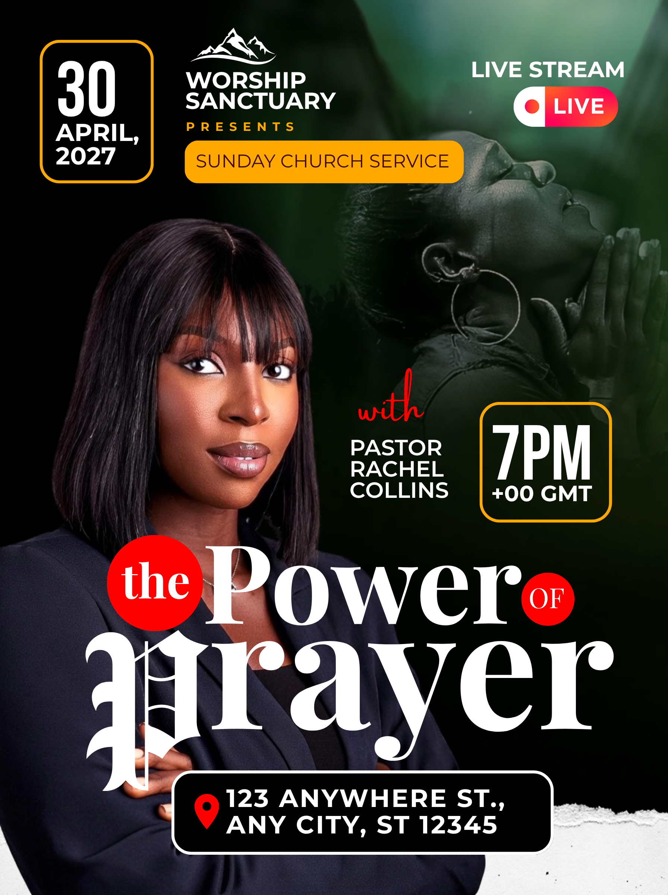

# Green and black editorial church service — oversized theme with red word accents

- **ID:** church-service-009
- **Category:** Church and Worship
- **Subcategory:** Church Service
- **Source:** user-supplied `Sunday Church Service Flyer.png`.
- **Status:** annotated-user-selected; visual observations and user-requested adaptations recorded below.
- **Editable source:** unavailable; flattened image only.
- **Tags:** editorial typography; theme-led; single speaker; green-black; red word circles; gold outlined schedule; optional livestream; optional prayer photograph; optional torn-paper footer.
- **Asset reuse:** reference only. Do not reuse example identities, portraits, logo or factual copy in new posters.

## Suitable brief and design character

A theme-led church service with one featured speaker and a short, expressive theme. Magazine-like editorial typography makes the theme the main attraction; the event title remains a smaller contextual label. This is a typography treatment, not an identified publication template or verified font match. Particularly suitable for concise themes with one or two dominant words and smaller connecting words.

## Composition and hierarchy

The full-page field is black and deep green. A subdued photograph of a praying person occupies the upper/right region, blending into the dark field. Its exact opacity, tint, masking and original source are unknown. A green overlay or reduced photo opacity over green can recreate the principle. Keep the image subordinate to copy and never confuse this atmospheric person with the named speaker.

At the top, a compact logo sits above the church name; beneath are an optional tracked Presents line and a gold rounded band containing the event title. The identity group sits between the date at upper left and an optional livestream badge at upper right. Reserve room for the actual church name rather than forcing a long name into the reference's dimensions.

The date occupies a tall rounded outline frame at upper left. A large day number leads stacked month/year text. A matching time frame appears further down on the right, beside the speaker name. Both use gold outlines with visually dark interiors; a transparent fill over the dark background is a suitable implementation. Date and time are spatially separated but connected by their matching frame treatment. Centre each entire text group vertically within its frame; horizontal centring is an approved variation. The day may be enlarged relative to the month/year. The time is prominent, with a smaller timezone only when supplied.

A large cutout speaker fills the left and lower area, with the face fully visible. A red script With appears beside the portrait above the white speaker name. The lower theme overlaps clothing, not the face. Role/name placement must clearly identify this speaker. Preserve image proportions and keep essential gestures visible when moving theme text.

The theme dominates the lower-middle area in oversized white high-contrast serif lettering. In the reference, Power and Prayer carry the weight. Prayer has an ornate blackletter-like initial P with a contrasting serif remainder. Short words the and OF appear in red circles. These are separate text and shape layers, grouped conceptually into one readable phrase. Circle size follows the word; do not automatically put arbitrary words in circles. The phrase must read in its intended order at thumbnail size. Use deliberate line breaks, optical spacing and restrained overlap. Exact fonts are unknown; choose available compatible typefaces without distorting glyphs.

At the bottom, a black rounded venue panel with a white outline and red location icon sits above a white torn-paper-like strip. Centre the venue text group with balanced padding and wrap long addresses deliberately. The strip is optional; it is a texture accent, not a required information container.

## Colour, typography and functional decoration

- Black/deep green provides atmosphere and a quiet field for the white lettering.
- Gold links the event band with both schedule frames.
- Red marks small editorial words, the speaker introduction and location icon; avoid spreading it across unrelated details.
- The large serif theme contrasts with simpler sans-serif identity, logistics and name text. A script introduction and ornate initial are optional accents; simplify them when they compete.
- The red word circles establish rhythm within the theme, while the gold frames connect separated date and time.
- Keep all text editable; create circles and frames as editable shapes. If an appropriate torn-paper asset is unavailable, omit it rather than approximating it with distracting decoration.

## Content and adaptation rules

- **Event wording:** use the supplied Sunday Service, Sunday Church Service or other exact title once. Example wording is not a default.
- **Theme:** use the supplied theme as the dominant editorial phrase, without requiring a Theme label. Never copy The Power of Prayer unless supplied. Recompose short connecting words and dominant words according to the new phrase.
- **Long theme:** simplify the initial/circles, use meaningful line breaks, and reserve more text area. Do not shrink the phrase until illegible.
- **No theme:** promote the event title into the editorial headline or choose another family; do not invent a theme.
- **Logo:** use only a supplied logo, above the church name. Without one, reclaim the space.
- **Presents:** optional. Remove it and close the gap when not requested.
- **Background photograph:** optional for this family. If explicitly uploaded for use, preserve it visibly; otherwise a dark green/black field can support the design alone.
- **Livestream:** show the badge only when streaming is explicitly supplied. Do not invent platforms or handles. Without streaming, rebalance the top group instead of leaving an empty badge.
- **Date/time:** include only supplied facts. If one is absent, remove its frame and reflow. Do not infer recurrence or a timezone. Never add Prompt after the time unless requested.
- **Multiple service times:** expand the time group or use a wider schedule frame while maintaining readable hierarchy and the gold frame treatment.
- **Speaker introduction:** red With may become a supplied Host, Guest or Ministering role, or be omitted. Preserve the person's exact name and title; never infer host status from appearance.
- **No speaker photo:** keep supplied name/role as text and reclaim portrait space for the theme. Do not invent a person.
- **Multiple speakers:** adapt to a balanced group with clearly associated labels only when space allows; otherwise choose a group-speaker family.
- **Venue:** preserve the supplied location, with a semantic location icon when available. Expand/wrap the bottom panel as needed. Remove it entirely if no venue is supplied.
- **Footer texture:** optional. Use an available suitable asset or omit it; keep footer content away from the torn edge.
- **Other canvas proportions:** this source is taller than the current 4:5 generator canvas. Reflow the upper identity and lower theme; do not scale all coordinates mechanically or clip the venue.

## Preserve and vary

Preserve the theme-first editorial hierarchy, oversized serif wording with selective small-word accents, matched schedule frames, a clear speaker association, and restrained gold/red accents over a dark field. Vary the actual phrase composition, portrait placement, background, palette, optional badge, initial treatment and footer texture to fit the brief. This family should not force every theme to contain red circles or an ornate initial.

## Quality checks and source uncertainty

Check the final render for readable phrase order, unclipped ornate strokes, unobstructed faces, correct name/photo association, balanced frame padding, and adequate contrast over photographs. Verify all supplied dates, times, venue details and optional streaming claims. The source pairs Sunday wording with 30 April 2027, which is a Friday: treat this as an example inconsistency, never copy it into a new design. Do not invent timezone or schedule wording to fill a frame.

The image establishes the visible arrangement, colours, word circles, mixed typography and footer texture. Exact fonts, layer stack, background transparency and original masking cannot be recovered from the flattened image. Transparent frame fills, increased day sizing, centred date text, alternate role labels and omission of optional elements are user-approved adaptations, not confirmed original settings.
