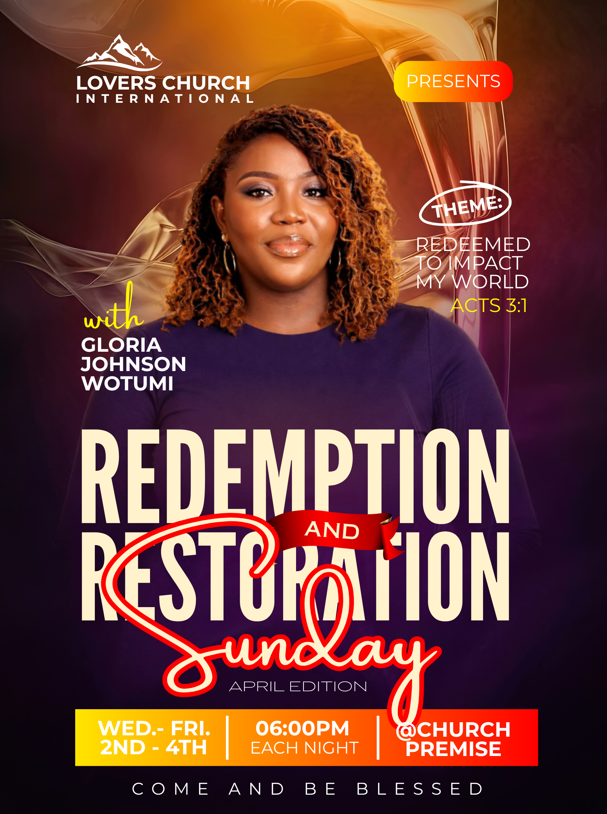

# Purple and gold church service — central portrait with layered occasion headline

- **ID:** church-service-010
- **Category:** Church and Worship
- **Subcategory:** Church Service
- **Source:** user-supplied `Redemption and Restoration Church Flyer.png`.
- **Status:** annotated-user-selected; image observations and user adaptations distinguished below.
- **Editable source:** unavailable; flattened image only.
- **Tags:** central-speaker; clothing-matched-palette; purple-gold; atmospheric-upper-background; theme-scripture; hand-drawn-oval; condensed-headline; outlined-script; gradient-logistics-strip; optional-presents; optional-edition.
- **Asset reuse:** reference only. Do not borrow example people, logo, church identity or wording for new posters.

## Suitable brief and design character

A speaker-led themed service or special church occasion with a short event name, optional separate theme and scripture reference, and compact date/time/venue details. One large central portrait anchors the design. A warm photographic upper field transitions into deep purple that echoes the speaker's clothing. Oversized condensed event words and an expressive script weekday create the main typographic statement.

## Composition and hierarchy

In the visible source, the logo and church name are at upper left and a separate rounded Presents badge is at upper right. The badge uses a yellow-to-orange-to-red horizontal gradient. The user's spoken left/right descriptions are approximate: follow the actual image for this arrangement. If Presents is omitted and the top has no competing content, a centred logo/name group is an approved variation. Keep the supplied logo compact, complete and uncropped.

The upper background has luminous gold/brown flowing fabric-like forms concentrated around the portrait. These are atmospheric, not essential scene content. The flattened image does not establish whether they are photographs, generated art, overlays or original layers. The lower field becomes dark purple/near-black, visually continuing the subject's purple top. Choose a palette from suitable clothing accents or supplied brand colours, while keeping natural skin tones; do not recolour the person's clothes merely to fit this example.

The central portrait is large and begins below the identity area, occupying much of the page width and continuing beneath the headline. Its head and face stay clear of all lettering. Side areas carry short secondary copy: the source places a yellow script With and white name at left, and a white Theme label, theme wording and yellow scripture citation at right. Name placement must clearly belong to the portrait, and a supplied title/role may replace With. Do not infer a role from appearance.

A loose white oval surrounds Theme. It is intentionally irregular and tilted, with a small extended stroke. It can be drawn with a pen/path tool where supported. Keep Theme as editable text independent of the stroke. In a generator limited to basic shapes, use a restrained tilted ellipse or omit the flourish; do not claim hand-drawn path support when unavailable. The accompanying theme and scripture need stronger contrast than the source in places: add a quiet translucent or solid backing if the photographic region competes, particularly behind the citation.

The main event name spans the lower portrait in two large, closely stacked condensed uppercase lines. Redemption and Restoration share the same type family and apparent size/weight. A small red ribbon carries AND between the lines. Its exact folds and shading are optional; a simple red backing or available ribbon asset preserves the connection without complex artwork. Keep the connecting word readable and the two principal lines aligned, adjusting line breaks for new wording rather than distorting letters.

Sunday is a large contrasting script word with a light fill and thick red outline, overlapping the main event name. Its sweeping capital provides motion, but its strokes must not obscure essential headline letters or the logistics below. April Edition is a small optional line beneath. A supplied Service subtitle can occupy that position when appropriate. Do not append either edition or service wording automatically.

Near the bottom, a broad yellow-through-orange-to-red gradient strip holds three functional columns: date/range, time and venue. White vertical separators organise the columns. White bold values contrast with smaller supporting labels. Treat each column's text as a group, centre it vertically with balanced padding, and reserve room for the actual wording. The source's script descender approaches this strip; improve the clearance when generating. An optional short footer sits below, widely tracked in white.

## Functional colour and typography

- Deep purple links the clothing and lower field, unifying subject and backdrop.
- Gold upper light provides separation around the head and shoulders.
- Cream/white gives the oversized condensed headline contrast on purple.
- Yellow highlights the introduction and scripture; red outlines the script and backs the connecting word.
- Repeating the same warm gradient in Presents and the logistics strip connects the top and bottom.
- Condensed sans-serif principal words contrast with the script weekday and simpler secondary text. Exact fonts are unknown.

## Content and adaptation rules

- **Event name:** a thematic event title such as Redemption and Restoration Sunday is a valid alternative to a generic Sunday Service heading when supplied or when the user explicitly authorises proposing a title. Never silently rename an event by deriving a new title from its theme. Keep the event name and separate theme semantically distinct.
- **Theme supplied:** display the exact theme, with the optional Theme label and oval. Remove the whole theme group if absent; do not leave an empty oval.
- **Scripture supplied:** retain the exact citation as supplied. Never invent a verse or infer that a citation supports the theme. Give it its own readable backing when necessary.
- **Speaker:** use the supplied photograph and exact name. With may become the supplied Pastor, Host, Guest or other role, or be omitted. Preserve natural proportions and clear facial features.
- **No portrait:** reclaim the centre for typography/background or choose a typography-led family; do not invent a speaker.
- **Multiple speakers:** this family primarily supports one dominant portrait. Adapt only when every supplied speaker and label can remain readable, otherwise choose a group layout.
- **Logo or Presents absent:** remove the absent component and rebalance; centring the identity is an approved variation. Never synthesize a logo.
- **Different clothing or brand:** adapt the lower field to a suitable sampled accent, maintaining contrast and natural skin tones. Purple is not mandatory.
- **Different background:** preserve a subordinate upper atmosphere and quieter lower text region. An explicitly supplied background must remain visible; without one, a gradient or solid field is sufficient.
- **Decorative oval/ribbon:** use editable paths only where supported. A simple ellipse or red shape is acceptable; omit decoration if it interferes with reading.
- **Different title length:** preserve a coherent headline block with matching main-word typography; simplify the ribbon/script overlap for long titles. Do not force identical widths with distorted letters.
- **No edition:** remove it and close the gap. Use Service there only if consistent with the supplied event wording and without repeating the title.
- **Date/time/venue:** include only supplied facts. When a column is absent, remove its separator and rebalance remaining columns. For several services, add readable schedule rows or enlarge the strip rather than compressing everything into one line.
- **Footer:** Come and be blessed is an optional invitation when requested or explicitly authorised for the new poster. It may instead hold a supplied website, contact or other relevant detail. Do not add a stock slogan by default.
- **Canvas proportions:** the reference is taller than the current 4:5 output. Reflow portrait, headline and footer together; do not clip the script descender, schedule or bottom text to fit.

## Preserve and vary

Preserve the clothing-linked background, strong central portrait, clearly separated side theme/name, matching main headline lines, contrasting outlined script, repeated warm gradient and organised logistics strip. Vary actual colours, wording, photograph, optional introduction/edition/footer, decorative complexity and column widths to suit the brief. Decorative elements serve hierarchy and grouping, not empty-space filling.

## Quality checks and uncertainty

Inspect at full size and thumbnail size. Verify clear faces, balanced portrait scale, correct name association, theme/scripture contrast, intact headline reading order, script-to-schedule clearance, and equal-feeling padding within each logistics column. Check all dates, weekdays, times and venue text against the new brief. The source combines Sunday naming with a Wednesday-Friday schedule: flag such contradictions rather than copying or silently resolving them. Never reuse its sample event details as defaults.

The visible image establishes the placement, colour relationships, large portrait, oval mark, ribbon, outlined script and gradient strip. Original fonts, background source, layer structure and exact effect settings are unknown. Centre-top identity without Presents, stronger theme/scripture backing, pen-tool construction, alternate role wording and website footer are user-proposed adaptations rather than confirmed original layers.
