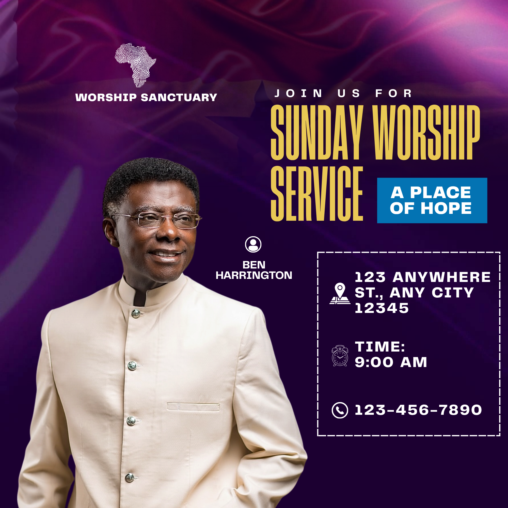

# Purple and gold worship service — left portrait with condensed headline and framed logistics

- **ID:** church-service-011
- **Category:** Church and Worship
- **Subcategory:** Church Service
- **Source:** user-supplied `Purple Yellow and Gold Bold Sunday Worship Service Poster.png`.
- **Status:** annotated-user-selected; observations from image, adaptations inferred from established user preferences.
- **Editable source:** unavailable; flattened square image, 2000 x 2000.
- **Tags:** left-speaker; square-layout; purple-texture; gold-condensed-headline; asymmetric-columns; blue-theme-card; framed-logistics; semantic-icons; no-date-in-source.
- **Asset reuse:** reference only; do not copy example people, logo, identity or factual text into new posters.

## Suitable brief and character

A concise speaker-led worship service announcement with a prominent portrait, event name, optional short theme or tagline, venue, start time and contact. The composition is asymmetric: a large light-clothed portrait anchors the left while a tall gold headline and information frame occupy the right. The dramatic contrast comes from scale, condensed lettering and the cream/purple relationship rather than numerous decorative panels.

## Composition and hierarchy

The full canvas is deep purple, with satin-like folds and brighter magenta highlights near the top and left. Faint star-like forms are visible behind the headline. The flattened image cannot establish whether these are part of the same artwork, overlays or separately drawn shapes. Keep this texture subdued and the right information region relatively quiet. Neither stars nor fabric imagery are essential; a supplied background or restrained purple field is an acceptable adaptation. Do not assume the background is a congregation photograph.

At upper left, a white fingerprint-like Africa silhouette sits above the bold church name. Treat this mark as the example church identity, not a reusable decorative icon. Use only the user's actual logo; remove it and rebalance the name when absent. The logo/name group belongs within the left column and needs clear space above the portrait.

The source has a widely tracked white Join us for line at upper right. Below it, very tall narrow uppercase gold text reads Sunday Worship on the first line and Service on the next. The line break leaves space beside Service for a compact blue rectangle with white A Place of Hope text. This makes the short theme/tagline part of the headline arrangement rather than a full-width subtitle. Exact font is unknown; try a suitable condensed display face such as bebas_neue or oswald and measure the actual lettering. Do not distort letters horizontally to force the same result. This is a deliberate uppercase block-font family, not a script family.

A large cutout portrait rises from the bottom left, with the lower body continuing beyond the page edge. The face is clear and sits below the identity. The light jacket separates strongly from the dark background. Preserve the person's proportions, skin tones and recognisable features; body-edge cropping may be deliberate, but protect the head and important gestures. Tune scale by visible subject bounds, not transparent padding. The portrait should occupy the reserved column instead of remaining a small figure at its bottom.

A small outlined person icon and a compact two-line white name sit near the inner shoulder, between the portrait and logistics frame. This icon is optional and not a role declaration. A supplied role may be placed above the name with a distinct size or font. Do not infer pastor/host status from the clothes or appearance. Ensure the label is visibly associated with the correct portrait.

The lower right contains one large rectangular frame with a dashed white outline and an apparently transparent/dark-purple interior. Inside are three vertically spaced rows: venue, time and phone number. Each row has a white semantic icon at left and bold text at right. The address wraps onto several lines; the time uses a smaller label above the value. Align the icon column and text starts, centre the complete group vertically in the frame and keep generous balanced padding. Long addresses require more room or a wider text column, not excessive font shrinking.

## Colour and functional decoration

- Deep purple provides the main field, gold the primary headline, and white the supporting information.
- The blue theme/tagline card introduces one controlled accent and creates a visual counterpart to Service. It is a flat blue fill in the visible source; gradients are not mandatory for this family.
- Satin highlights supply atmosphere. They must not weaken title or small-text contrast.
- Dashed borders separate logistics without adding an opaque heavy card. Where dashed strokes are unavailable in the generator, use a thin solid outline; do not imitate dashes with dozens of tiny layers.
- Use a consistent semantic icon set for location, clock and phone. The source mixes icon detail levels; matching stroke weight and visual scale is a recommended improvement.

## Content and adaptations

- **Event title:** preserve the actual supplied title once. Do not add Worship simply because the reference includes it. Adapt line breaks to the title and available theme-card width.
- **Invitation:** Join us for is optional and should appear only when requested or authorised for the new brief. Otherwise remove it and close the gap.
- **Short theme/tagline:** use supplied wording in the blue card. A Place of Hope is example content, not a default or automatically inferred theme.
- **Long theme:** move the card below the complete headline or widen it; preserve padding and readability. Do not squash long copy beside Service.
- **No theme/tagline:** remove its card and give the event heading the reclaimed width. Do not leave an empty blue box.
- **Logo:** use only the actual supplied mark, small and uncropped. No logo means a text-only identity group.
- **Portrait:** use the supplied image with natural aspect ratio. A lighter outfit is not required; use subtle separation when darker clothing merges with the field. No photo means rebalance the typography or choose another family, never invent a speaker.
- **Speaker name/role:** preserve exact supplied spelling and titles. The optional person icon may be omitted. Keep role and name visually distinct and clearly associated with the image.
- **Multiple speakers:** this composition is built around one left-column subject. Use a clearly labelled balanced group only if every person remains readable; otherwise prefer a group reference.
- **Date:** none is visible in the source. A missing date does not prove weekly recurrence. Add an explicitly supplied date near the time in the logistics group and resize the frame.
- **Several services:** use labelled schedule rows and reserve additional frame height. Never drop a supplied time to retain three rows.
- **Missing venue/time/contact:** remove that row and its icon, then rebalance the remaining group. Do not leave empty icon rows.
- **Website/social details:** add a supplied website or contacts as another row or a reserved footer; do not invent handles or platforms.
- **Background:** the texture is optional, but an explicitly supplied background should remain recognisable. Preserve a quieter region behind logistics.
- **Different aspect ratio:** the reference is square. For 1080 x 1350, redesign the column proportions, portrait scale and row spacing; do not stretch the square artwork or let the address run off the right edge.

## Preserve and vary

Preserve the large left portrait, strong light/dark separation, condensed gold title, compact optional accent card and one neatly aligned logistics frame. Vary the actual palette, background texture, portrait, wording, frame size and icon treatment. Keep intentional negative space, but avoid unused space inside an oversized frame or an underfilled portrait column.

## Quality checks and uncertainty

Check identity spacing, headline line breaks, title/tagline separation, face visibility, name association and safe margins. In particular, the source's frame sits close to the right edge; retain a comfortable output margin. Inspect the actual framed content for balanced top/bottom space, consistent row rhythm, coherent icons and readable address wrapping. Verify all supplied facts and do not infer dates, recurrence, speaker roles or livestream availability.

Visible evidence supports the square composition, purple textured field, gold condensed lettering, blue tagline panel, large light-clothed portrait and white dashed information frame. Font identity, original layer stack, texture source, transparency settings and cutout method remain uncertain. Added date rows, role labels, consistent icons, solid-border fallback and portrait-format reflow are adaptations based on established user preferences, not features confirmed in this image.
