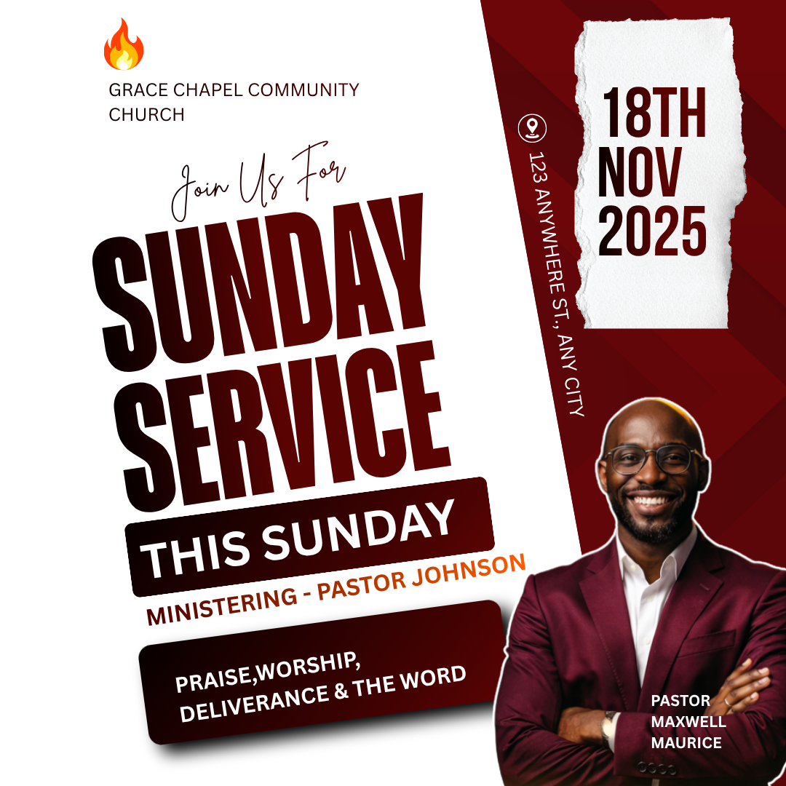

# Diagonal white and maroon service — tilted headline with date sidebar

- **ID:** church-service-013
- **Category / subcategory:** Church and Worship / Church Service
- **Tags:** diagonal-layout; tilted-headline; date-sidebar; torn-paper-optional; right-speaker.
- **Source:** user-supplied `Red White and Black Typographic Sunday Service Poster.png`.
- **Status:** annotated-user-selected; individual visual analysis.
- **Editable source:** unavailable; flattened image only.
- **Asset reuse:** reference only; example identity, imagery and wording are not reusable defaults.

## Suitable brief and design character

A square, energetic invitation combining a large diagonal typographic field with a narrow maroon date-and-portrait sidebar. It suits a short event title, one speaker and concise programme copy. The visual signature is coordinated tilt and a strong diagonal division; it should not be reduced to an ordinary upright title on a red background.

## Composition and hierarchy

Most of the left canvas is white. A sloping boundary creates a deep-maroon right wedge, broad at the top and narrower near the lower speaker region. Subtle darker diagonal facets give the wedge depth. The upper-left identity uses a small flame-like logo above two lines of church name. Use only the actual supplied logo; the flame is not a generic default.

Below the identity, a thin mixed-case script Join Us For introduces an enormous two-line condensed headline. The title, a dark subtitle band and the ministering line share a counterclockwise tilt, creating a coherent group. Treat their rotations and offsets as one composition. Match the two headline rows optically, maintain readable counters and avoid crowding the church name. The dark title fill appears to transition between near-black and maroon; exact gradient settings are uncertain.

A dark rounded This Sunday band sits below the main title, followed by a smaller ministering line. A larger dark programme card at the bottom-left has a noticeable shadow and white bold copy. Its tilt follows the headline. These are hierarchy devices, not invitations to repeat Sunday multiple times. Use only supplied secondary information and omit a redundant band rather than filling it with This Sunday by default.

At top right, a vertically torn white paper strip holds a bold stacked date. A white location icon and rotated address run along the diagonal edge to its left. The date feels like a separate pinned note. If a torn-paper asset is unavailable, use a plain white date panel; keep the date editable. Rotated address text is a reference feature, but long addresses are better moved to a horizontal footer or card for readability.

The speaker is bottom-right, extending beyond the page edges with a light outline. The face stays within the maroon field and the torso overlaps the boundary into white. A small white role/name sits over the jacket. Preserve natural proportions and contrast; do not crop the face or let the programme card cover it.

## Typography, palette and functional effects

Condensed heavy uppercase text dominates. The invitation uses flowing script with mixed casing; secondary labels use simpler sans-serif. Maroon, black and white provide the main contrast, with a restrained orange/red accent in the ministering line and example logo. Use coordinated angles rather than arbitrary rotation per element. The shadow under the programme card should lift it subtly, not blur the copy. A gradient headline can echo the sidebar, but does not replace the need for clean alignment.

## Content meaning and adaptation

The example contains two different speaker-name statements: a ministering line names Pastor Johnson while the portrait label names Pastor Maxwell Maurice. Do not assume they refer to one person, swap labels or fabricate a second speaker. New briefs must identify each person's role and photo explicitly. The source also combines Sunday wording with 18 November 2025, a Tuesday; never carry that mismatch forward.

- Use the exact supplied event title once. Remove redundant This Sunday wording unless explicitly requested.
- If a theme is supplied, the dark band or programme card can hold it. Do not invent praise, worship, deliverance or other programme items to populate the card.
- Dates and times must both remain readable; the source has no visible time. Add supplied time beside/below the date or in a rebalanced footer, rather than omitting it.
- Long dates need a wider date panel or shorter accepted month format, not extremely compressed glyphs. Missing date means remove the paper panel entirely.
- A long venue should move out of the rotated rail. Preserve full supplied wording with deliberate line breaks.
- No portrait: extend the sidebar into a useful logistics region. Several speakers: use a group layout or smaller labelled portraits with sufficient space, not accidental overlaps.
- No logo, invitation or programme: remove those components and rebalance the diagonal title group.
- Match a replacement portrait to its correct name. Roles and names remain distinct in size or weight.
- If the generator cannot construct a sloped field with supported shapes, use a clean simplified split or another suitable family; do not simulate a complex edge with excessive layers.
- On a taller canvas, reflow the entire tilted group within safe margins and keep the date and speaker separated vertically.

## Preserve, vary and quality checks

Preserve the coordinated tilted title group, white/maroon asymmetry and independent date note. Vary the angle modestly, wording, panel proportions, portrait crop and texture. Check rotated bounding boxes at every corner, title legibility, paper-panel padding, speaker-name consistency and any date/weekday contradiction. Avoid reproducing the source's redundant title, ambiguous speaker identities or cramped rotated address. Compare the rendered result at thumbnail size; diagonals should guide the eye without making information hard to read.

## Evidence and uncertainty

Visible features establish the angled typography, diagonal field, torn-paper date, rotated address and outlined portrait. Exact font, shadow parameters, paper source and gradient stops are unknown. Simplified paper treatment, horizontal long-address fallback and removal of repeated title wording are recommended adaptations.
