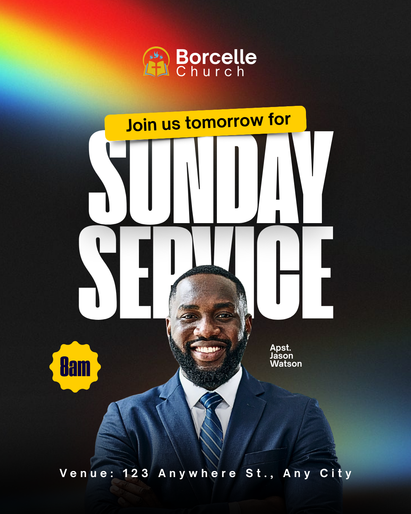

# Dark luminous service — oversized title with centred portrait and time badge

- **ID:** church-service-014
- **Category / subcategory:** Church and Worship / Church Service
- **Tags:** central-speaker; luminous-background; time-badge; condensed-title; yellow-accents.
- **Source:** user-supplied `Modern Church Service Instagram Post.png`.
- **Status:** annotated-user-selected; individual visual analysis.
- **Editable source:** unavailable; flattened image only.
- **Asset reuse:** reference only; example identity, imagery and wording are not reusable defaults.

## Suitable brief and design character

A portrait-format, high-impact service announcement with very little logistics copy. The design pairs a nearly black field with soft rainbow light, an oversized white headline and one central speaker. It is best for a short title, one time and a concise venue. The light effects remain atmospheric; the headline and face provide the recognition at thumbnail size.

## Composition and hierarchy

A soft red/orange/yellow/green/blue glow enters from the upper-left corner against a textured black background. A cooler blue glow appears near the lower-right. These may be blurred imagery or layered gradients, but their original construction is unknown. Keep most of the field dark enough for the white title and preserve the supplied background if one is intended for use.

Near the top centre, a compact logo sits beside a two-line church identity. Beneath it, a slightly tilted yellow rounded invitation strip overlaps the top of the huge title. Its short black copy and restrained shadow make it feel like a label laid over the lettering. The source says Join us tomorrow for: tomorrow is time-sensitive and must never be inferred from a reference. Use only brief-authorised invitation wording.

Sunday and Service are tightly stacked, tall, white condensed letters spanning most of the width. Service has visible grey-to-white shading near its top. A linear text gradient is a plausible implementation, not proof of extrusion. The title remains an editable two-line block. Avoid arbitrary extra font families or heavy effects: the scale and light field carry the style.

The central speaker rises from the bottom and overlaps the middle of Service. The source hides parts of the letters behind the head, creating depth, but the event remains inferable. Prefer a smaller controlled overlap that preserves every word's readability, and always keep the face unobstructed. If the current renderer places all text above images, position the text to avoid the face rather than claiming foreground layering that will not survive compilation.

A yellow scalloped time badge is placed left of the portrait at roughly shoulder level. Dark condensed text is centred inside it. The role/name is a compact white stack to the right. At the bottom, a widely tracked venue line crosses the darker lower clothing region. A lower fade helps the portrait terminate into black and improves footer readability.

## Typography, palette and functional decoration

Use a tall heavy display face such as anton or bebas_neue for the event block. Supporting identity, invitation and venue use simpler sans-serif. Yellow repeats between the invitation and time badge and stands against the dark field; it should not spread to every line. The scalloped edge is optional: use a circle or restrained star-like badge if the editor cannot create smooth scallops. Keep the text inside the usable interior, not near the points. The glows provide direction and colour variation without demanding literal images of church objects.

## Content meaning and adaptation

The source shows an invitation, Sunday Service, a named speaker with an abbreviated title, 8am and a venue. There is no specific date, website or logo provenance. Preserve the exact supplied speaker title; do not expand unfamiliar abbreviations without confirmation. Do not interpret the absence of date as recurrence.

- Include only supplied invitation wording; remove the yellow strip if absent, or use a supplied short theme there when appropriate.
- With two or more service times, replace the small badge with a readable schedule card or paired badges. Every service label must stay associated with its time.
- A supplied date can sit with the time; reserve extra area instead of adding a tiny line inside the original badge.
- Long venue copy should use normal tracking and multiple lines or its own backing. Do not keep wide letterspacing at the expense of readability.
- No portrait: enlarge or reposition the title and logistics without leaving an empty lower subject slot. Multiple portraits need a group variation with names clearly mapped.
- No logo: retain only the supplied church name and adjust the top spacing.
- A theme must be given a purposeful region; reduce headline height slightly if necessary. Do not invent a theme to populate the yellow strip.
- A detailed brief is better served by another family or a larger information region; avoid reducing all footer text to tiny sizes.
- Gradient and lighting colours may adapt to the supplied brand and clothes, while keeping the background subordinate to face and title.

## Preserve, vary and quality checks

Preserve the dark luminous field, tight giant title, centred foreground subject and two small yellow accents. Vary the specific glow colours, badge shape, typeface, invitation and crop. Inspect the title/portrait boundary carefully: readable letters and a clear face matter more than exact source overlap. Verify any relative date wording against the user's intended publication context. Check badge padding, role/name association, footer contrast and safe bottom clearance. A dark fade must not erase the supplied speaker or make the venue disappear.

## Evidence and uncertainty

Visible: coloured corner light, dark texture, tilted yellow invitation, shaded white condensed title, central portrait overlap, yellow time badge and tracked venue. Unknown: exact fonts, glow construction, photo-cutout method and original fade settings. Layer-order fallback and larger schedule variants are adaptations, not confirmed source techniques.
