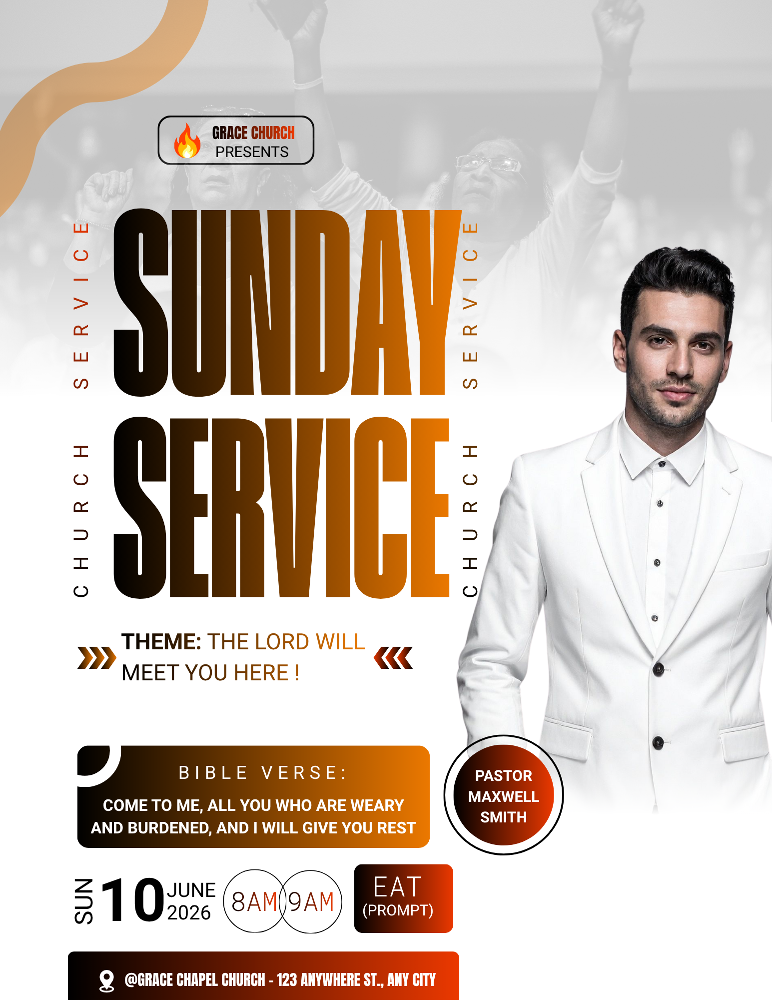

# White and amber service — gradient title with scripture card and right portrait

- **ID:** church-service-016
- **Category / subcategory:** Church and Worship / Church Service
- **Tags:** right-speaker; pale-worship-background; gradient-title; scripture-card; schedule-circles.
- **Source:** user-supplied `Black and White Modern Sunday Service Poster.png`.
- **Status:** annotated-user-selected; individual visual analysis.
- **Editable source:** unavailable; flattened image only.
- **Asset reuse:** reference only; example identity, imagery and wording are not reusable defaults.

## Suitable brief and design character

A tall, content-rich service poster using a pale congregation photograph, warm dark-to-orange gradients and a large right-hand portrait. It accommodates a theme and scripture quotation alongside logistics. The visual emphasis is a very large left title and bright uncluttered subject area. Despite the filename, the design is not purely monochrome: amber, orange, brown and red are functional accents.

## Composition and hierarchy

The upper background is a greyscale worship photograph washed towards white. The people and raised hands remain visible but subordinate. A thick curved gold ribbon enters from the top-left edge, framing the identity region without carrying information. Its complex curve is optional; use an available decoration asset, a supported simple curve or omit it. Do not construct many unnecessary pieces to imitate it.

A small rounded black-outline identity box sits above the title with a flame-like example logo, church name and Presents. Use the real church identity only. The source then places huge condensed Sunday and Service lines down the left, filled with a horizontal black/brown-to-orange gradient. Narrow rotated words flank this title: Service alongside Sunday and Church alongside Service, repeated on both sides. These are decorative repetitions in the example, not required content. Prefer abstract rules or no side labels instead of repeating the event wording by default.

A large speaker in a light suit occupies the right side from near the title's top to the lower information area. The pale clothes merge somewhat into the white field; preserve subtle separation through contrast, careful crop and a clean edge rather than an exaggerated shadow. The face is fully clear. The bottom of the portrait fades to white. A circular name badge sits near the lower-left edge of the subject: a warm gradient centre, white surrounding space and thin black outer outline. Keep it associated with the photo and do not cover important gestures.

Below the main title, a two-line theme is flanked by small warm chevrons. Beneath that is a wide rounded black-to-orange scripture card with a small corner cutout-like white/black accent. A tracked Bible Verse label tops bold white quotation text. The card should have balanced padding and sufficient height for the actual quotation. The ornate corner is optional; it must not take usable text space.

The schedule row includes a large day number with smaller month/year, a vertical weekday, two outlined time circles and a gradient timezone box. A warm gradient venue bar follows at the bottom. The source ends very close to the page edge; new output needs safe margins rather than reproducing the clipped-looking footer.

## Typography, colour and functional decoration

The title uses a heavy condensed family such as anton, with real editable gradient fills. Supporting text is simpler sans-serif. Amber gradients recur in the title, scripture panel, name badge and footer, making a coherent palette rather than unrelated cards. Keep black at the dark end and enough luminance contrast for white card copy. Chevrons point towards the theme; they are optional and can be simple symbols. Rotated metadata is less readable, so important weekday information should be horizontal when space permits.

## Content meaning and adaptation

The source provides a theme, a Bible quotation, a named speaker, a June date, two time values, EAT and venue. It pairs SUN with 10 June 2026, which is a Wednesday. The two time circles do not explain whether they are two service starts or one interval. Never infer either interpretation. Prompt appears as example wording in the timezone box, not as an instruction.

- Use each event title once; do not repeat Church/Service down both sides unless explicitly asked.
- Include only the supplied scripture text/reference. Do not invent a verse to fill the large card. If absent, remove the card and expand schedule or theme spacing.
- Keep the exact theme and make its label optional according to the brief. Long themes need fewer decorations and more width.
- Explicitly label multiple services or preserve an explicitly supplied time range. Do not represent an interval as two independent starts.
- Show timezone only when supplied. Missing date does not imply recurrence; remove empty date/time containers and reflow.
- Long names may need a rectangular badge instead of a circle. Keep role and name distinct, with a readable font size.
- A background is optional, but a supplied one must remain visible. Pale treatment should preserve recognisable atmosphere without interfering with dark title text.
- Several speakers need a balanced group or another reference; the right column is intended for one substantial subject. No portrait means reclaim the right side for information.
- Long venue text must wrap in a taller footer and remain within margins. Additional contacts need a separate row, not tiny text squeezed below the page.
- This source is unusually tall. On 4:5 output, simplify rotated decoration and allocate space to mandatory facts before scaling the portrait and title.

## Preserve, vary and quality checks

Preserve pale photographic atmosphere, warm gradient title, large right subject and distinct theme/scripture/schedule hierarchy. Vary the actual hues, portrait and panel shapes. Verify date/weekday agreement, time semantics, scripture accuracy relative to the supplied brief, name-badge association and footer clearance. Avoid unreadable small side lettering and excessive repeated title words. Ensure the white suit remains visibly separated and every gradient card has balanced readable text.

## Evidence and uncertainty

Visible: pale crowd, amber curve, gradient headline, rotated repeated words, scripture panel, right portrait and round time/name shapes. Original curve geometry, exact gradient stops, font and fade method are uncertain. Removing repeated copy, labelling times and increasing footer margins are improvements inferred from established preferences.
