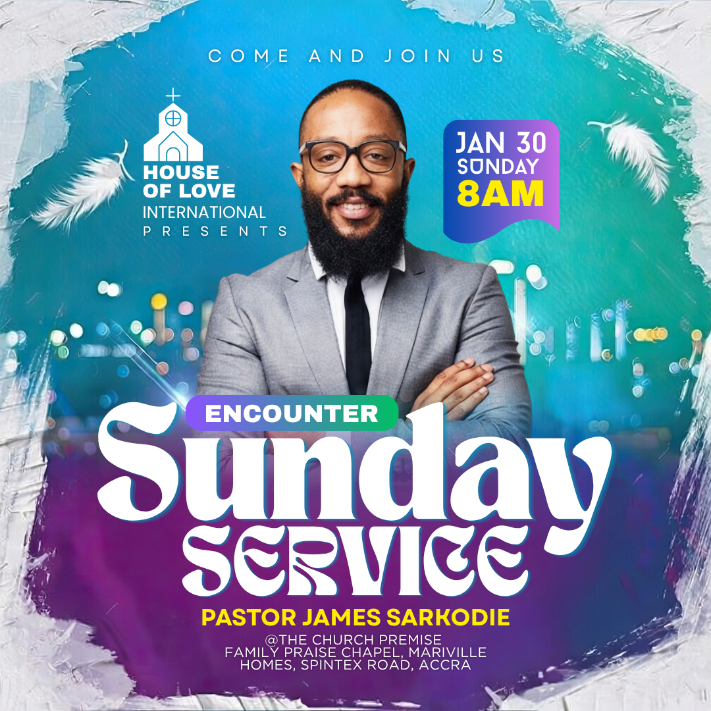

# Turquoise and purple encounter — expressive title inside a textured border

- **ID:** church-service-018
- **Category / subcategory:** Church and Worship / Church Service
- **Tags:** central-speaker; expressive-serif; textured-border-optional; gradient-date-badge; turquoise-purple.
- **Source:** user-supplied `Sunday Service Church Event Instagram Post.png`.
- **Status:** annotated-user-selected; individual visual analysis.
- **Editable source:** unavailable; flattened image only.
- **Asset reuse:** reference only; example identity, imagery and wording are not reusable defaults.

## Suitable brief and design character

A square, vibrant speaker-led event design with an icy or crumpled-paper-like border, a turquoise upper field and purple lower typography region. It combines one central portrait, compact identity/date groups and expressive mixed display lettering. This family is useful for a concise special service with a short supplied modifier such as Encounter, but the modifier is not a default.

## Composition and hierarchy

An irregular white/silver textured edge surrounds almost the whole canvas, opening into a blue-green centre. The material looks like folded foil, textured paper or frost; the flattened image cannot establish which. Do not insist on a literal material interpretation. A simple light border or no texture is acceptable when no suitable asset is available. Keep all essential content inside its irregular safe area.

The upper background shifts from bright turquoise to greenish blue, with faint bokeh and blurred lights behind the lower portrait. A purple/magenta region develops behind the large title. White feather-like decorations occupy the upper sides. They are optional atmospheric accents, not platform icons or proof of a theme about doves. Avoid adding them without a suitable asset and purpose.

A tracked Come and join us line sits across the top. The left identity group uses a white church icon/logo over stacked church name and Presents. The central speaker rises nearly to the invitation line, framed by identity at left and a date/time badge at right. His head and face are clear; folded arms terminate behind the headline region. Keep scale prominent without crowding the top line or confusing the badge with the portrait.

The upper-right date/time badge has a blue-to-purple gradient, rounded upper corners and an asymmetric wavy bottom. Date and weekday are white; the large time is yellow. Centre the complete text group in its usable interior. A normal rounded rectangle is a valid fallback if the generator cannot reproduce the wave. Do not create a complex clipping shape at the expense of readable logistics.

A small purple-to-green rounded band carrying Encounter crosses the lower portrait, immediately above the main title. Sunday is enormous white mixed-case decorative serif text; Service beneath uses a different rounded, ornamental display style with curled internal forms. Thin blue/purple offset edging gives the title separation. Exact fonts and whether this is outline, shadow or shallow extrusion are uncertain. Prefer available expressive editable fonts with a restrained outline; do not claim an exact typeface match or turn the lettering into a flattened image.

A bold yellow speaker name sits below the title, followed by several compact white venue lines. The text is centred within the inner border. The venue is small and close to the bottom texture in the source; give it more padding and fewer awkward line breaks when adapting.

## Typography, palette and functional decoration

The key distinction is expressive serif/display lettering rather than an all-condensed Sunday Service block. A suitable available serif can approximate Sunday; a rounded display face may approximate Service if the exact decorative font is unavailable. Flowing scripts, if used as alternatives, should use Service in mixed case. Turquoise and purple define the atmosphere, with yellow reserved for time and name. Gradients link the date badge and modifier strip, while white unifies title and identity. The border and feathers should remain secondary to the face and text.

## Content meaning and adaptation

The source provides a church identity, invitation, Encounter modifier, January 30 Sunday without a year, 8am, a named pastor and venue. No year is visible, so the weekday/date cannot be verified from the image alone. Do not infer a year or reuse this date for new posters. Encounter and Presents are optional wording, not mandatory content slots.

- Use a supplied event modifier/theme in the small gradient strip; remove it and close the gap if absent. Do not automatically add Encounter.
- Keep the main title exact and readable once. The decorative face may change, but do not invent extra wording to balance the two lines.
- Include the year when supplied, and keep date/time together. Multiple service times need a larger badge or a separate schedule card rather than tiny extra text.
- A missing date means remove its lines and centre the time; missing time means a date-only badge. If neither is supplied, remove the badge.
- Use only the actual logo and speaker image. No logo means a text identity group; no portrait means recompose the centre or choose a typography-led family.
- Role and name must come from the brief. Additional speakers require a group arrangement with clear labels, not a duplicated central subject.
- Long venue text needs a larger quiet footer region. Reduce decorative title flourish or border thickness before shrinking essential directions.
- A supplied background must remain visible. The complex textured border may be omitted; do not rasterise the whole poster to simulate it.
- On portrait output, expand vertical spacing around the speaker/title/footer and redraw safe margins. Do not stretch the square border or crop away the date.

## Preserve, vary and quality checks

Preserve the bright upper portrait area, darker lower title field, expressive two-face headline, compact date badge and consistent yellow highlights. Vary textures, optional motifs, actual gradient hues and title fonts. Check face clearance, readability of decorative counters, complete wording, date/year semantics, badge padding and border-safe footer margins. Prevent ornate title strokes from covering the name or address. A simpler supported effect is better than a visually broken imitation of the reference.

## Evidence and uncertainty

Observed: irregular silver/white border, feathers, central portrait, turquoise/purple field, wavy gradient date badge, modifier band and ornate headline. Exact texture material, image sources, fonts and title effect settings remain unknown. Rounded-badge fallback, border simplification and increased venue space are deliberate adaptations based on the user's established preferences.
