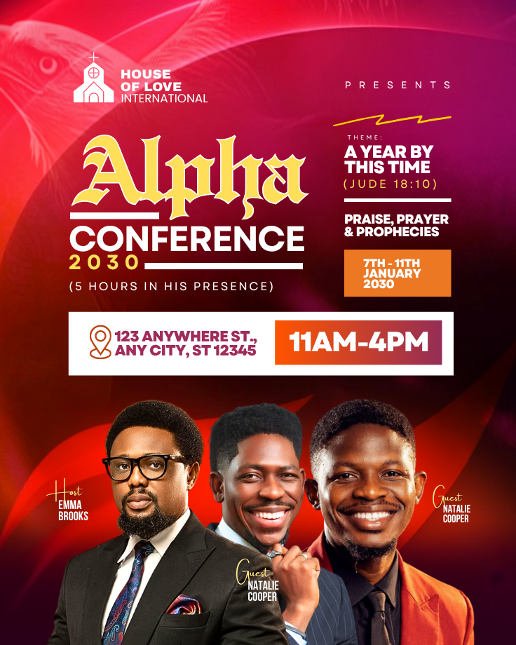

# Red and gold Alpha conference — ornate title, compact agenda and three speakers

- **ID:** conference-001
- **Category / subcategory:** Church and Worship / Conference
- **Tags:** multi-day-conference; three-speakers; blackletter-title; gradient-time-bar; theme-scripture.
- **Source:** user-supplied `Red Gold And Purple Bold Alpha Conference Event Poster (1).png`.
- **Status:** annotated-user-selected; individual visual analysis.
- **Editable source:** unavailable; flattened image only.
- **Asset reuse:** reference only; example identity, imagery and wording are not reusable defaults.

## Suitable brief and design character

A multi-day church conference with several named participants, a short distinctive conference name, a theme/scripture reference, date range, daily time and venue. The upper portion organises dense information in two columns; the lower portion is a three-person ensemble. This belongs to Conference rather than Church Service. Preserve that semantic distinction even when borrowing its colour or portrait arrangement for other occasions.

## Composition and hierarchy

The background is a saturated red, crimson and purple field with broad dark sweeping bands, pink light near the top and faint eagle imagery at upper left. These layers create movement and a darker base behind text and faces. They are atmospheric, not evidence of an eagle-related theme. The actual image and mask construction are unknown; a simpler warm field can preserve the structure.

A small white church logo/name occupies upper left. Across from it, a widely tracked Presents line tops the right column, followed by a short yellow zigzag stroke. Under the identity, Alpha is the main visual word in large gold blackletter-style lettering with a light outline. Conference is a contrasting bold white sans-serif line below, framed by horizontal white rules. The year is smaller, gold and widely spaced. A small parenthetical duration statement follows. Keep this collection as one identity/event block; the ornate name should remain readable, not become generic condensed lettering.

The right column contains a small Theme label, bold stacked theme text, a yellow scripture citation, a short white divider, programme words and an orange date rectangle. Type size distinguishes the main theme from its label and citation. The orange date panel provides a compact anchor while the white line separates theme and programme. Do not fill this column with invented activities when they are absent.

A broad white venue/time strip spans the page below both columns. Its left area has an outlined location icon and magenta address; its right area contains a warm orange-to-magenta gradient with large white time-range text. Treat it as one aligned information bar with two capacities, not two unrelated floating boxes. Centre the text groups vertically and preserve room for the actual address.

Three cutout portraits fill the bottom. The left and right figures are large foreground anchors; the centre person is set slightly behind and overlapped at the shoulders/lower torso. Every face is visible. Nearby labels use small yellow mixed-case script roles and compact white names. This source does not make the host central: role-based prominence must follow the brief, not a universal rule that the centre is always host. Preserve per-person photo/name associations and natural proportions.

## Typography, colour and functional decoration

The event name uses blackletter-like display type; exact font is unknown. Select an available suitable font if supported, otherwise use an expressive readable serif and explicitly treat that as a simplification. Supporting Conference, themes and logistics are bold sans-serif. Script Host/Guest labels use initial capitals and lowercase continuations. Gold ties together name, year, scripture and role labels; red/purple unifies the backdrop; white is the organising contrast. Decorative rules and the zigzag add separation but may be simplified or omitted. They should never substitute for real information.

## Content meaning and adaptation

The source includes an event name, conference year, duration wording, theme, scripture citation, programme, multi-day range, daily time range, venue and three role/name labels. Two guest labels repeat the same name despite different photos. Do not infer that they are the same person, or assign the example names to uploaded people. Use the supplied roster exactly. The scripture reference should not be assumed accurate or relevant merely because it appears in the artwork; preserve supplied citations and flag questionable ones for confirmation rather than inventing corrections.

- Keep event name, theme and programme distinct. Do not silently turn a conference title into a Sunday-service title or derive a new event name from its theme.
- Date ranges need explicit month/year and clear inclusivity. Show daily/session timing as supplied; do not infer that a time range applies every day unless stated.
- Duration statements such as five hours are optional; do not calculate or add them as promotional copy without authorisation.
- More than three speakers require a new row/grid with readable faces and labels. Two speakers need a balanced pair; one needs a re-centred portrait. Never duplicate a portrait to fill the source arrangement.
- Associate each supplied role with its correct photo. If roles are absent, use equal prominence or supplied ordering rather than guessing who hosts.
- Long venue wording needs a larger white bar or a separate row. Multiple schedules may need a dedicated agenda region rather than the compact bar.
- Remove absent scripture/theme/programme blocks and reflow the right column; do not leave a blank orange panel or rules around nothing.
- Use only a supplied logo and background. The eagle and zigzag are optional. Keep skin tones natural despite the saturated palette.
- Contacts/registration/website belong in a deliberately reserved footer; shorten decorative areas before reducing required information to tiny text.

## Preserve, vary and quality checks

Preserve the ornate conference name contrasted with a simpler descriptor, two-column upper information, venue/time bar and face-safe ensemble. Vary portrait count, role emphasis, palette, typography and optional programme. Check name/photo mapping, duplicated labels, date-range clarity, legibility of the ornate title and exact contact information. Ensure the bar never covers faces and all role labels are closer to their person than another. This recipe requires conference-specific retrieval; it must not be selected automatically for ordinary Sunday-service requests.

## Evidence and uncertainty

Observed: ornate gold title, layered warm background, dense upper columns, white logistics bar and three overlapping portraits. Exact font, eagle source, background construction and cutout method are unknown. Layout simplifications and larger roster variants are inferred adaptations. This reference is catalogued for Conference; the current Church Service generator does not yet provide a conference workflow.
